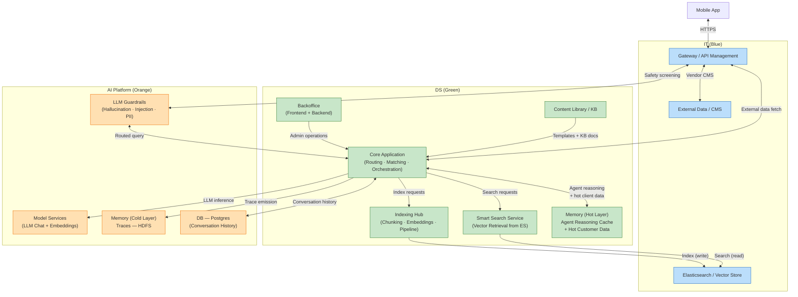
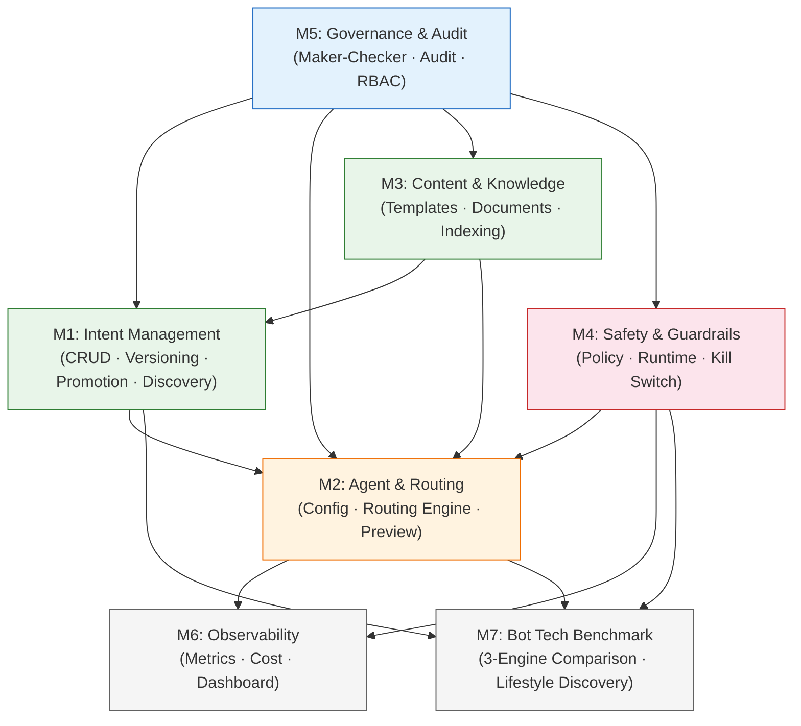
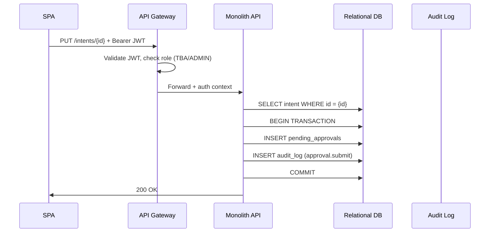
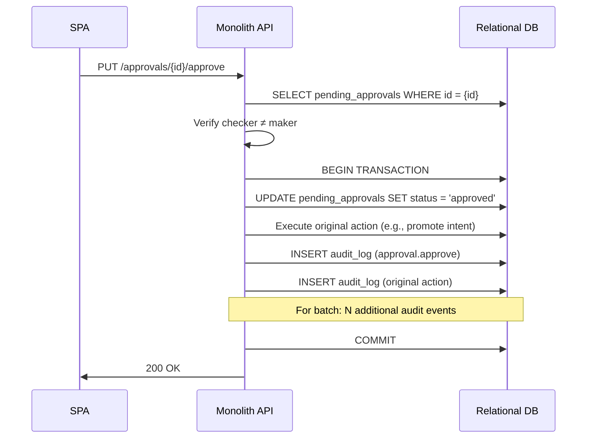
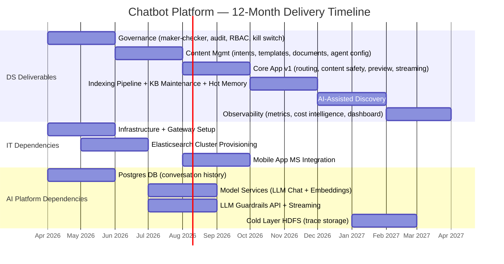

# Chatbot Platform — System Architecture & Developer Specification

> System-level architecture with team ownership, DS module details, API specification, data model, cross-team dependencies, and delivery timeline.
>
> **Date:** 2026-03-29
> **Version:** 3.0
> **Status:** Draft — pending team lead review and signoff
> **Audience:** DS team leads and developers (primary) | IT and AI Platform leads (dependency coordination)
> **Related:**
> - [User Functionality Guide](USER_FUNCTIONALITY_GUIDE.md) — what each module does from the user's perspective
> - [Vendor-Agnostic Strategy](STRATEGY_VENDOR_AGNOSTIC.md) — architecture decisions, capability-to-vendor matrix, phased roadmap, MAS compliance mapping

---

## How to Use This Document

1. **System Architecture Overview** (Section 1) — high-level system flow, team ownership, memory architecture
2. **DS Scope Definition** (Section 2) — what DS builds, what DS does NOT own, frontend and model service considerations
3. **DS Module Details** (Section 3) — per-module feature list, build-vs-vendor options, submodule breakdown
4. **API Specification** (Section 4) — endpoint listing + detailed schemas for critical flows
5. **Data Model** (Section 5) — entity relationships and key schemas
6. **Cross-Team Dependencies** (Section 6) — IT and AI Platform dependencies, unresolved ownership items
7. **Timeline & Gantt Chart** (Section 7) — 12-month delivery timeline with capability blocks, Gantt chart, and risks
8. **Cross-Cutting Concerns** (Section 8) — auth, audit, maker-checker, error handling

---

## 1. System Architecture Overview

### 1.1 High-Level System Flow



### 1.2 Team Ownership

#### IT (Blue)

| Component | Description | Interface to DS |
|-----------|-------------|-----------------|
| Gateway / API Management | API gateway, auth passthrough, rate limiting | DS registers routes on gateway |
| Elasticsearch / Vector Store | Hosted cluster for vector storage + retrieval | DS writes via Indexing Hub, reads via Smart Search Service |
| External Data / CMS | Vendor CMS solution | DS queries via gateway |
| Infrastructure Hosting | Compute, networking, CI/CD pipeline | Standard deployment |
| Mobile App Microservices | IT-side microservices that Core Application serves | HTTPS, service-to-service auth |
| Postgres Microservice Layer | MS layer providing access to Postgres | DS reads/writes Postgres via this MS layer (not direct DB access) |

#### DS (Green)

| Component | Description | Interface to Other Teams |
|-----------|-------------|--------------------------|
| Backoffice (FE + BE) | React SPA (8 modules: Active Topics, Topic Discovery, Observability, Bot Tech Benchmark, Active Agents, Content Library, Audit Trail, Change Control) + monolith API backend | — |
| Core Application | Routing engine, intent matching, agent orchestration | Calls AI Platform Model Services + LLM Guardrails; reads/writes Postgres via MS layer |
| Indexing Hub Extension * | Document chunking, embedding orchestration, pipeline state machine (write path) | Pushes embeddings to IT Elasticsearch |
| Smart Search Service Extension * | Vector similarity retrieval from Elasticsearch (read path) | Queries IT Elasticsearch |
| Content Library / KB | Response templates + knowledge documents | Feeds Core Application |
| Hot Memory Layer | (1) Agent reasoning cache. (2) Hot customer/client data | Managed by Core Application (key-value store) |
| Logging Implementation | Structured log events and audit records | Writes to Postgres via MS layer |
| Content Safety Policies | Blocked topics, denied words — TBA-configurable | Enforced in routing pipeline before LLM call |
| Kill Switch | Global emergency GenAI disable. Both activate/deactivate require maker-checker | Persisted in system state table + cache |
| KB Maintenance Flow for BU | Upload, approve, index, re-index knowledge documents | BU-facing workflow through backoffice UI |

\* *Indexing Hub and Smart Search Service are existing DS central services that may need enhancement to handle chatbot-scale request volumes.*

#### AI Platform (Orange)

| Component | Description | Interface to DS |
|-----------|-------------|-----------------|
| Model Services (LLM Chat + Embeddings) | LLM inference for agent responses and query embedding | HTTPS API |
| LLM Guardrails (Hallucination, Injection, PII) | Screening API for pre-LLM and post-LLM safety checks | HTTPS API |
| DB — Postgres (Conversation History) | Conversation history storage | Managed by AI Platform; DS reads/writes via MS layer |
| Cold Layer (HDFS Traces) | Routing traces, guardrail outcomes, latency measurements | DS emits traces; AI Platform manages storage and retention |

### 1.3 Memory Architecture

The platform uses a three-tier memory model:

| Tier | What It Stores | Owner | Interface |
|------|---------------|-------|-----------|
| **Hot** | (1) Intermediate agent reasoning results — scratchpad state during multi-step agent execution. (2) Hot customer/client data — frequently accessed client profile or session data cached for low-latency retrieval during conversations. | DS | In-process or fast cache (key-value store), managed by Core Application |
| **Warm** | Conversation history — full user sessions stored in Postgres | AI Platform manages DB; DS reads/writes via MS layer | Microservice layer API (REST/gRPC) |
| **Cold** | Traces — routing traces, guardrail outcomes, latency measurements stored in HDFS | AI Platform manages storage; DS puts traces | HDFS API / SDK — DS emits, AI Platform stores and manages retention |

---

## 2. DS Scope Definition

### 2.1 DS Deliverables

| Deliverable | Description | Phase |
|-------------|-------------|-------|
| **Backoffice Frontend** | React SPA with 8 modules: Active Topics, Topic Discovery, Observability, Bot Tech Benchmark (3-engine comparison + Lifestyle Discovery), Active Agents, Content Library (Templates + Documents), Audit Trail, Change Control | 1-3 |
| **Backoffice Backend** | Monolith API (Phase 1) decomposing into focused services as complexity grows | 1-3 |
| **Core Application** | Routing engine (embed query, match intent, dispatch to GenAI/Template/Exclude), agent orchestration, streaming responses | 2 |
| **Indexing Hub Extension** | Document chunking, embedding orchestration, pipeline state machine (pending/indexed/failed/stale). Existing DS central service — may need enhancement for chatbot-scale volumes. | 2 |
| **Smart Search Service Extension** | Vector similarity retrieval from Elasticsearch for query routing and RAG. Existing DS central service — may need enhancement for chatbot-scale request volumes. | 2 |
| **Content Library / Knowledge Base** | Response templates, knowledge documents, KB maintenance flow for BU (upload, approve, index, re-index) | 1-2 |
| **Content Safety Policies** | Blocked topics, denied words — TBA-configurable via backoffice, enforced in routing pipeline before LLM call | 1-2 |
| **Kill Switch** | Global emergency control — all GenAI routing falls back to template responses. Both activation and deactivation require maker-checker approval | 1 |
| **Hot Memory Layer** | (1) Agent reasoning cache — intermediate results during multi-step agent execution. (2) Hot customer/client data — cached client profiles and session data for low-latency access during conversations. | 2 |
| **Logging Implementation** | DS writes structured log events and audit records; stored in Postgres via MS layer | 1 |
| **Observability** | Metrics emission (query volume, guardrail hits, intent distribution), query-to-response time measurement, token response rate tracking | 2-3 |

### 2.2 What DS Does NOT Own

| Capability | Owning Team | Interface to DS |
|------------|-------------|-----------------|
| LLM model hosting / serving | AI Platform | HTTPS API — DS calls for chat completions and embeddings |
| LLM Guardrails (hallucination, injection, PII screening) | AI Platform | HTTPS API — DS calls from routing pipeline (pre-LLM and post-LLM) |
| Gateway / API management | IT | DS registers routes; IT manages auth passthrough, rate limiting |
| Elasticsearch / Vector Store | IT | DS sends index requests (via Indexing Hub) and search/query requests (via Smart Search Service) |
| External data / CMS | IT | Vendor solution; DS queries via gateway |
| Cold storage (HDFS) | AI Platform | DS puts traces; AI Platform manages retention and access |
| DB — Postgres (Conversation History) | AI Platform | DS reads/writes via MS layer, not direct DB access |
| RBAC | TBD | May be DS-built authorizer or IT gateway-level enforcement — resolve before Phase 1 |

### 2.3 Frontend Considerations

- An **OpenWebUI-like solution** has been evaluated but is likely insufficient for this platform's needs. Key gaps:
  - No native support for linking backoffice template management to chatbot template-mode responses
  - Limited streaming response integration with custom routing pipelines
  - No built-in backoffice admin suite (approval queues, audit trails, intent management)
- **Recommendation:** Custom build with streaming support. The React SPA provides full control over:
  - Streaming response rendering for GenAI-path chatbot preview
  - Template-mode intent linking (backoffice templates directly power chatbot responses)
  - Dual-mode preview (production + personal diff overlay)
  - Integrated admin workflows (maker-checker, audit, kill switch) alongside chatbot interaction
- **Current POC state:** React 19 SPA with Vite 6. Bot Tech Benchmark and Lifestyle Discovery already make real LLM calls via serverless API routes (`api/hybrid.ts`, `api/rag.ts`, `api/wow-vision.ts`). Admin suite modules use mock/localStorage data.

### 2.4 Model Service Considerations

- **Routing AI agent — open vs closed source models:** Decision is TBD.
  - **Pro open-source:** Cost control at scale, no vendor lock-in, on-premise deployment option, full model weight access for fine-tuning if needed later
  - **Pro closed-source:** Higher baseline quality, managed infrastructure (less operational burden), faster iteration on new capabilities, stronger reasoning for complex routing
- **Streaming response support** is required from the model service — both for real-time chatbot preview and production routing
- **No custom model training** — the platform will use pre-trained models only (chat + embeddings). Prompt engineering and retrieval-augmented generation (RAG) are the primary customization mechanisms.

---

## 3. DS Module Details

### M1: Intent Management

**Purpose:** Full lifecycle management of chatbot intents — from AI-assisted discovery and creation, through editing and maintenance, to production deployment and versioning.

#### Submodules

| ID | Submodule | Description | Phase |
|----|-----------|-------------|-------|
| M1.1 | Intent CRUD (Active Intents) | Read, update, delete existing intents. Multi-column filtering (name, risk, mode, status). Edit utterances (manual), response text, response mode. Toggle status. Per-intent version history + restore. | 1 |
| M1.2 | Per-Intent Versioning | Per-intent change history (who changed what, when). Restore to prior version with approval. Stored in relational DB. | 1 |
| M1.3 | Promotion Pipeline & DB Snapshots (Intent Discovery) | Create new intents (manual + AI). Staging → PendingApproval → Production lifecycle. Batch promotion. DB-level snapshots on each promotion (immutable, 7-year retention). Rollback to prior DB snapshot. | 1 |
| M1.4 | AI-Assisted Discovery (Intent Discovery) | Upload knowledge sources → LLM extracts intents → generate diffs with confidence scores → AI-assisted utterance + response generation → human review → approve to staging. | 3 |

**Key distinction:** M1.1/M1.2 power the **Active Intents** tab (manage existing). M1.3/M1.4 power the **Intent Discovery** tab (create new, promote, snapshot). DB snapshots (M1.3) capture the entire intent database state; per-intent versioning (M1.2) tracks individual intent changes.

#### Feature List

**Active Intents (M1.1/M1.2):**
- Multi-column search and filtering (name, risk level, response mode, status)
- View environment badges (STAGING / PROD) and risk level (High / Low) per intent
- Edit existing intents: name, utterances (manual add/remove), response text
- Response mode selection: GenAI / Template / Exclude per intent (inline or edit modal)
- Toggle intent status (active/inactive) with approval
- Per-intent version history viewing + restore to prior version with approval
- Delete intents (production only) with approval

**Intent Discovery (M1.3/M1.4):**
- Manual intent creation via form (name, utterances, response, response mode)
- AI-powered intent discovery from uploaded documents (PDF, DOCX, URL, folders)
- AI-assisted utterance generation and response drafting
- Diff review: new / modified / deleted intents with confidence scores
- Inline diff editing before acceptance
- Batch approval to staging + batch promotion to production
- DB-level snapshot on each promotion (immutable, Object Lock, 7-year retention)
- Compare staging vs production side-by-side
- Rollback to prior DB snapshot

#### Build vs Vendor

| Capability | Build (Custom) | Vendor Option(s) | Recommendation |
|-----------|---------------|-----------------|----------------|
| Intent CRUD API | Node/TS + Relational DB (standard REST) | — | Build |
| Multi-column filtering & search | SQL WHERE + full-text search | — | Build |
| Version history + snapshots | DB versioning table + object storage | — | Build |
| Promotion pipeline (staging → prod) | Custom state machine + maker-checker integration | — | Build |
| AI utterance generation | LLM API call + prompt engineering | Managed LLM service (see [Vendor Matrix](STRATEGY_VENDOR_AGNOSTIC.md#part-3-capability-to-vendor-matrix)) | Vendor (LLM) + custom prompt |
| AI intent discovery | LLM + document parsing + diff algorithm | Custom build on managed LLM | Build (on vendor LLM) |
| Immutable snapshot storage | Object storage with compliance lock | See vendor matrix: Object Storage | Vendor service |

**Dependencies:** M5 (maker-checker, audit), M3.1 (template linking)

---

### M2: Agent & Routing

**Purpose:** Configure AI agents, route customer queries to the correct agent based on intent matching, and provide a three-engine comparison benchmark sandbox.

#### Submodules

| ID | Submodule | Description | Phase |
|----|-----------|-------------|-------|
| M2.1 | Agent Configuration | Fully configurable by Technical BAs through the platform. View agents with metrics. Edit system prompt (4,000 char limit), model selector, temperature slider, max tokens. Intent routing editor (checkbox-based). Status toggle (active/inactive). No create-agent UI — agents are pre-provisioned. | 1 (config), 2 (live routing) |
| M2.2 | Query Routing Engine | Embed query → vector similarity search (via Smart Search Service → Elasticsearch) → intent match → dispatch to GenAI / Template / Exclude path. Kill switch integration. Routing trace generation. | 2 |
| M2.3 | Bot Tech Benchmark | Three-engine comparison tool demonstrating Traditional NLU, Hybrid (Traditional + GenAI), and Full GenAI RAG approaches side-by-side. Each engine has distinct routing, latency, and risk characteristics. The POC already makes real LLM calls via serverless API routes (`api/hybrid.ts`, `api/rag.ts`, `api/wow-vision.ts`). Includes Lifestyle Discovery sub-view with two parallel UX approaches (Vision Upload + Visual Picker) for image-based retirement tier assessment using a vision-capable LLM. In production, maps to the routing engine's response mode dispatch (template/genai/exclude). | 2 |

#### Feature List

- Agent editing: name, description, category (Wealth, General, Loans, Services, Security), system prompt, model ID, temperature, max tokens
- Intent-to-agent routing table (many-to-one: multiple intents → one agent)
- Agent status toggle (active/inactive) with maker-checker
- Disable agent with maker-checker approval
- Per-agent metrics: sessions handled, error rate, average response time
- Agent editing: name, description, category, system prompt (4,000 char limit), model ID (configurable per deployment), temperature (0.0-1.0), max tokens
- Query embedding (embedding model) → cosine similarity via Smart Search Service (Elasticsearch) → intent match
- Three-way dispatch: GenAI (invoke agent) / Template (fetch template) / Exclude (block response)
- Kill switch check on every route (5-second cache for performance)
- Routing trace: intent matched, confidence %, risk level, mode, agent, guardrail outcome
- Streaming response support for GenAI path and chatbot preview
- Three-engine comparison sandbox:
  - **Traditional (NLU):** TF-IDF similarity → template response (<50ms, deterministic)
  - **Hybrid (Traditional + GenAI):** Simple → template, Complex → LLM with routing trace (~800ms)
  - **Full GenAI (RAG):** Always LLM-powered, streaming, knowledge-grounded (1-4s)
- Routing trace per message: intent matched, confidence %, response mode
- Quick-action preset query chips
- Hallucination cache demonstration (pre-cached failure scenarios)
- Out-of-scope detection and low-confidence disambiguation
- Lifestyle Discovery (two parallel UX approaches in side-by-side phone mockups):
  - **Vision Upload:** User uploads a photo → vision LLM classifies lifestyle tier
  - **Visual Picker:** User picks from curated image grid → tier determined by selections
  - ~50 curated lifestyle images across 3 tiers (16 aspirational, 18 balanced, 16 essential)
  - Vision LLM analysis → tier classification + reasoning
  - Product recommendations per tier (Aspirational/Balanced/Essential)
  - Image compression (max 1024x1024, JPEG quality 0.85) before API call
  - Images preloaded into browser cache on module load

> **AI Platform dependency:** Query embedding calls AI Platform's Model Services for vector generation. Model selection (open-source vs closed-source) is TBD — see Section 2.4.

#### Build vs Vendor

| Capability | Build (Custom) | Vendor Option(s) | Recommendation |
|-----------|---------------|-----------------|----------------|
| Agent CRUD API | Node/TS + Relational DB | — | Build |
| Intent routing table | Junction table + API | — | Build |
| Query embedding | LLM embedding API call | Managed LLM Embeddings (see [Vendor Matrix](STRATEGY_VENDOR_AGNOSTIC.md#part-3-capability-to-vendor-matrix)) | Vendor service |
| Vector similarity search | Smart Search Service (existing DS central service) queries IT's Elasticsearch | Dedicated vector service (Pinecone, Weaviate, etc.) | Smart Search Service + Elasticsearch (existing infra) |
| Routing engine (dispatch logic) | Custom: embed → match → route → trace | — | Build |
| Agent orchestration (GenAI path) | Custom agent invocation | Managed AI Agents (see vendor matrix) | Vendor + custom wrapper |
| Bot Tech Benchmark sandbox | Custom React component + three-engine comparison API | — | Build |
| Routing trace generation | Custom middleware | — | Build |

**Dependencies:** M1 (intents for routing), M3 (templates + documents for responses), M4 (guardrails for screening), M5 (maker-checker, audit)

---

### M3: Content & Knowledge

**Purpose:** Manage response templates (deterministic responses) and knowledge documents (AI retrieval source) that power chatbot responses.

#### Submodules

| ID | Submodule | Description | Phase |
|----|-----------|-------------|-------|
| M3.1 | Template Management | CRUD for markdown response templates with `{{variable}}` placeholders. Version history, intent linking, publish with approval. | 1 |
| M3.2 | Document Management | Upload, tag, and manage knowledge documents (PDF/DOCX/TXT/URL). Domain tagging. Status monitoring. | 1 (upload/metadata), 2 (indexing) |
| M3.3 | Indexing Pipeline | Document chunking → embedding generation → vector storage. Status tracking (pending/indexed/failed/stale). Re-indexing triggers. | 2 |

#### Feature List

- Template CRUD with markdown editor
- Variable extraction from `{{placeholder}}` syntax
- Template-to-intent linking (many-to-many)
- Template preview with sample variable substitution
- Template versioning with restore capability
- Template publish with maker-checker approval
- Document upload: PDF, DOCX, TXT, URL (drag-and-drop)
- Domain tagging: multi-select from defined domains
- Indexing status tracking: Pending → Indexed / Failed / Stale
- Re-index triggers: manual per-document + bulk for all stale/failed
- Document metadata: uploader, date, file size, chunk count
- Activity log for indexing operations

#### Knowledge Base Maintenance Flow for BU

- BU uploads knowledge documents through Content Library (backoffice UI)
- Documents go through maker-checker approval before indexing
- DS Indexing Hub chunks documents and generates embeddings
- Embeddings pushed to IT's Elasticsearch for vector retrieval
- BU can request re-indexing for stale/failed documents
- DS provides ops dashboard: indexing status, failure alerts, stale detection
- Design goal: BU can maintain knowledge base independently with minimal DS support

#### Build vs Vendor

| Capability | Build (Custom) | Vendor Option(s) | Recommendation |
|-----------|---------------|-----------------|----------------|
| Template CRUD + versioning API | Node/TS + Relational DB | — | Build |
| Markdown editor (frontend) | Existing textarea (already in POC) | Rich markdown editor (MDXEditor, Tiptap) | Build (basic) or vendor (rich) |
| Variable extraction + preview | Custom regex parser | — | Build |
| Document upload + metadata API | Node/TS + object storage SDK | — | Build |
| Document chunking | Custom (split by section/page) | LangChain text splitters, Unstructured.io | Vendor library |
| Embedding generation | LLM embedding API call | Managed Embeddings (see vendor matrix) | Vendor service |
| Vector storage (write) | Indexing Hub (existing DS central service) pushes to Elasticsearch | — | IT dependency (Elasticsearch hosting) |
| Vector retrieval (read) | Smart Search Service (existing DS central service) queries Elasticsearch | — | IT dependency (Elasticsearch hosting) |
| Indexing pipeline orchestration | Custom state machine (pending → indexed) | Step Functions / Durable Functions | Build (simple state machine) |

**Dependencies:** M5 (maker-checker for template publish), M1 (intent linking)

---

### M4: Safety & Guardrails

**Purpose:** Configurable safety layer that screens all AI interactions — before LLM invocation (input screening) and after (output screening). Includes emergency kill switch.

#### Submodules

| ID | Submodule | Description | Phase |
|----|-----------|-------------|-------|
| M4.1 | Policy Configuration | CRUD for guardrail policies: blocked topics, denied words/phrases, exclusion template, sensitivity levels, PII masking toggle. | 1 (config), 2 (live enforcement) |
| M4.2 | Runtime Guardrail Engine | Orchestration layer: DS handles content safety locally (blocked topics, denied words) then calls AI Platform guardrails service for injection/hallucination/PII screening. Pre-LLM: DS local content safety check + AI Platform injection detection. Post-LLM: DS output word filter + AI Platform hallucination detection + PII masking. | 2 |
| M4.3 | Kill Switch | Global kill switch (all GenAI → template fallback). Both activation and deactivation require maker-checker approval. | 1 |

#### Feature List

- Blocked topics CRUD (add/remove from list)
- Denied words/phrases CRUD
- Exclusion response template editor
- Sensitivity level configuration: Hallucination (Off/Low/Medium/High/Strict), Injection (Off/Low/Medium/High/Strict)
- PII masking toggle
- Guardrail test panel: submit test query → see pass/block/flag result
- Guardrail statistics: queries screened, blocks this week
- Pre-LLM screening: topic check, injection detection, denied word filter
- Post-LLM screening: hallucination detection, PII masking, output word filter
- Policy synced to key-value store for fast reads during routing
- Global kill switch: both activation and deactivation require maker-checker approval. State persists across sessions.
- Kill switch state cached with 5-second TTL for routing performance

#### Build vs Vendor

| Capability | Build (Custom) | Vendor Option(s) | Recommendation |
|-----------|---------------|-----------------|----------------|
| Policy config API | Node/TS + Relational DB | — | Build |
| Content safety screening (blocked topics, denied words) | Custom keyword matching | — | Build (DS) |
| Exclusion template rendering | Custom (simple template substitution) | — | Build |
| Pre-LLM input screening orchestration | Custom rules + AI Platform guardrails call | — | Build (DS orchestration) |
| Post-LLM output screening orchestration | Custom rules + AI Platform guardrails call | — | Build (DS orchestration) |
| Injection detection | AI Platform guardrail service | Managed Guardrails (see [Vendor Matrix](STRATEGY_VENDOR_AGNOSTIC.md#part-3-capability-to-vendor-matrix)) | AI Platform dependency |
| Output word filtering | Custom denied word matching on LLM output | — | Build (DS) |
| Hallucination detection + PII masking | AI Platform guardrail service | Managed Guardrails, Guardrails AI, NeMo Guardrails | AI Platform dependency |
| Kill switch (global only) | Custom (key-value store flag + cache) | — | Build |
| Guardrail test panel API | Custom (route test query through pipeline) | — | Build |

**Dependencies:** M5 (maker-checker for policy changes), M2 (routing engine integration)

---

### M5: Governance & Audit

**Purpose:** Cross-cutting governance layer. Every write operation in the platform flows through maker-checker approval. Every action is recorded in an immutable audit trail. Access is enforced by role at the API gateway.

#### Submodules

| ID | Submodule | Description | Phase |
|----|-----------|-------------|-------|
| M5.1 | Maker-Checker Engine | Approval queue: submit, list pending, approve/reject. Self-approval prevention (maker ≠ checker). Batch approval support. State machine: pending → approved/rejected. | 1 |
| M5.2 | Audit Trail | Append-only event log. DELETE/UPDATE revoked at DB level. Filter by action type, entity type, actor role, severity, date range. CSV export. Before/after state diffs. | 1 |
| M5.3 | RBAC Enforcement | API gateway authorizer function. JWT validation + group-to-role mapping. Per-route permission matrix. 5 roles: TBA, MGMT, ADMIN, BA, DEV. | 1 |

> **Note:** RBAC ownership is TBD — may be DS-built authorizer or IT gateway-level enforcement. Resolve before Phase 1 development begins.

#### Feature List

- Approval submission API (accepts any `ApprovalActionType`)
- Approval listing with filtering (status, action type, submitter)
- Approve with optional note / Reject with required reason
- Self-approval prevention: `checker_id ≠ maker_id` enforced at API level
- Batch approval support (e.g., promote 5 intents at once)
- Cascading audit events on batch approval (one per item)
- Append-only audit log: INSERT only, DELETE/UPDATE/TRUNCATE revoked via DB grants
- Audit event schema: actor, role, action, entity, before/after, severity, timestamp
- Audit filtering: action type, entity type, actor role, severity, date range, free-text search
- Audit pagination (15 per page default)
- CSV export of filtered audit results
- Before/after JSON diffs for configuration changes
- JWT validation at API gateway (signature, expiry, claims)
- IdP group → platform role mapping
- Per-route permission check: method + path + role → allow/deny
- Standardized 403 response for unauthorized access

> **Note:** DS implements logging logic; stored in Postgres via MS layer.

#### Build vs Vendor

| Capability | Build (Custom) | Vendor Option(s) | Recommendation |
|-----------|---------------|-----------------|----------------|
| Maker-checker engine | Custom state machine + API | — | Build |
| Approval queue API | Node/TS + Relational DB | — | Build |
| Self-approval prevention | Custom validation middleware | — | Build |
| Audit trail API (append-only) | Node/TS + Relational DB + DB-level REVOKE | — | Build |
| Audit CSV export | Custom (streaming CSV) | — | Build |
| Before/after diff capture | Custom middleware (snapshot before write) | — | Build |
| RBAC authorizer function | Custom JWT validation + role matrix | OPA (Open Policy Agent), Casbin | Build (simple matrix) or vendor (complex policies) |
| IdP federation (SAML/OIDC) | Identity broker configuration | See vendor matrix: Identity Broker | Vendor service + config |

**Dependencies:** None — M5 is a foundation module that other modules depend on.

---

### M6: Observability

**Purpose:** Collect, aggregate, and expose chatbot operational metrics. Per-agent cost attribution. Executive dashboard data API.

#### Submodules

| ID | Submodule | Description | Phase |
|----|-----------|-------------|-------|
| M6.1 | Metrics Collection | Emit custom metrics on every routed query: intent, mode, agent, latency, guardrail outcome. Aggregate in time-series format. | 2 |
| M6.2 | Cost Intelligence | Track LLM token usage per agent. Calculate cost per 1K queries. Month-over-month trend. Daily cost cache (key-value store, 48h TTL). | 3 |
| M6.3 | Dashboard API | Aggregated KPI endpoint: query volume, satisfaction, trending topics. Per-agent metrics endpoint. Cost intelligence endpoint. | 3 |

#### Feature List

- Custom metric emission per routed query (intent, mode, agent, latency, guardrail result)
- Query volume aggregation by time period (hourly, daily, weekly)
- Customer satisfaction tracking (per-query feedback aggregation)
- Per-agent metrics: sessions handled, fallback rate, average latency, satisfaction
- Trending topic detection (volume spike analysis)
- Per-agent cost tracking: sessions × tokens × token price
- Cost per 1,000 queries calculation
- Month-over-month cost trend
- Daily cost cache in key-value store (48h TTL)
- Intent distribution aggregation (pie chart data)
- Guardrail hit rate breakdown by category
- Kill switch status exposure
- Dashboard data API: `/dashboard/kpis`, `/dashboard/agents`, `/dashboard/costs`
- Query-to-response time measurement
- Token response rate tracking
- Trace emission to AI Platform cold layer (HDFS)

#### Build vs Vendor

| Capability | Build (Custom) | Vendor Option(s) | Recommendation |
|-----------|---------------|-----------------|----------------|
| Metric emission middleware | Custom (emit on every route) | — | Build |
| Metrics aggregation | Custom (scheduled aggregation job) | Observability platform native (see [Vendor Matrix](STRATEGY_VENDOR_AGNOSTIC.md#part-3-capability-to-vendor-matrix)) | Vendor platform + custom queries |
| Cost tracking | Custom (LLM API usage → per-agent attribution) | Cloud cost management APIs | Build + vendor cost API |
| Trending topic detection | Custom (volume spike algorithm) | — | Build |
| Dashboard data API | Node/TS + cache layer | — | Build |
| Alerting (threshold-based) | Custom | Observability platform alerts | Vendor |

**Dependencies:** M2 (routing engine emits metrics), M4 (guardrail outcomes), M5 (RBAC for dashboard access)

---

### M7: Bot Tech Benchmark & Lifestyle Discovery

**Purpose:** Demonstration and evaluation environment comparing chatbot engine architectures, plus multimodal AI lifestyle assessment.

#### Submodules

| ID | Submodule | Description | Phase |
|----|-----------|-------------|-------|
| M7.1 | Three-Engine Comparison | Side-by-side comparison of Traditional NLU, Hybrid, and Full GenAI RAG engines. Each demonstrates a different routing and response strategy with distinct latency/risk profiles. Maps directly to production routing modes. | 2 |
| M7.2 | Lifestyle Discovery | Image-based retirement tier assessment using vision AI (multimodal LLM). Two parallel UX approaches: Vision Upload (user uploads a photo for AI classification) and Visual Picker (user selects from ~50 curated images across 3 tiers). AI classifies into Aspirational/Balanced/Essential tier → returns product recommendations. | 2 |

#### Feature List

- Three-engine comparison: Traditional NLU (<50ms), Hybrid (~800ms), Full GenAI RAG (1-4s streaming)
- 5 core intents: CPF Life, Retirement Planning, Gap Analysis, Investment, Life Events
- TF-IDF similarity engine for Traditional NLU path
- Routing trace display: intent, confidence %, response mode
- Hallucination cache for demonstration of failure modes
- Out-of-scope detection and low-confidence disambiguation
- Quick-action preset query chips
- Lifestyle image pool (~50 curated images across 3 tiers: 16 aspirational, 18 balanced, 16 essential)
- Two parallel UX approaches: Vision Upload (user photo → AI classification) and Visual Picker (curated grid selection)
- Image compression (max 1024x1024, JPEG quality 0.85) before API call; images preloaded on module load
- Vision AI analysis → tier classification + reasoning + advice
- Product recommendations per tier (OCBC product catalog integration)

#### Build vs Vendor

| Capability | Build (Custom) | Vendor Option(s) | Recommendation |
|-----------|---------------|-----------------|----------------|
| Three-engine comparison UI | Custom React component | — | Build |
| TF-IDF similarity engine | Custom (lightweight, no ML deps) | — | Build |
| Routing trace display | Custom (reuses M2.2 trace format) | — | Build |
| Vision AI (image analysis) | LLM vision API call | Claude Vision, GPT-4V, Gemini Vision | Vendor (multimodal LLM) |
| Product recommendation mapping | Custom tier-to-product lookup | — | Build |

**Dependencies:** M2 (routing engine for Hybrid/RAG paths), M4 (guardrails for screening), M1 (intents for routing)

---

### Module Dependency Graph



**Read as:** M5 (Governance) is a dependency of M1, M2, M3, M4 — every module uses maker-checker and audit. M1 (Intents) feeds M2 (Routing) and M7 (Benchmark). M3 (Content) feeds M1 (template-linked intents) and M2 (knowledge documents for agents). M4 (Guardrails) feeds M2 (runtime screening) and M7 (screening). M2 (Routing) feeds M7 (engine comparison).

---

## 4. API Specification

### 4.1 Route Overview

All routes are prefixed with `/api/v1`. Authentication via Bearer JWT in the `Authorization` header. Authorizer function validates JWT and checks RBAC before request reaches the handler.

#### Intent Routes (Active Intents — M1.1/M1.2)

| Method | Path | Purpose | Auth Roles | Module | Phase |
|--------|------|---------|-----------|--------|-------|
| GET | `/intents` | List intents (filterable by name, risk, mode, status, env) | TBA, MGMT, ADMIN, BA, DEV | M1.1 | 1 |
| GET | `/intents/{id}` | Get intent detail | TBA, MGMT, ADMIN, BA, DEV | M1.1 | 1 |
| PUT | `/intents/{id}` | Update intent (triggers approval) | TBA, ADMIN | M1.1 | 1 |
| DELETE | `/intents/{id}` | Delete intent (triggers approval, prod only) | TBA, ADMIN | M1.1 | 1 |
| PUT | `/intents/{id}/status` | Toggle active/inactive (triggers approval) | TBA, ADMIN | M1.1 | 1 |
| PUT | `/intents/{id}/response-mode` | Change response mode (triggers approval) | TBA, ADMIN | M1.1 | 1 |
| GET | `/intents/{id}/versions` | List per-intent version history | TBA, MGMT, ADMIN, BA, DEV | M1.2 | 1 |
| POST | `/intents/{id}/rollback` | Restore to prior version (triggers approval) | TBA, ADMIN | M1.2 | 1 |

#### Discovery Routes (Intent Discovery — M1.3/M1.4)

| Method | Path | Purpose | Auth Roles | Module | Phase |
|--------|------|---------|-----------|--------|-------|
| POST | `/discovery/intents` | Manually create new intent (staging) | TBA, ADMIN | M1.3 | 1 |
| POST | `/discovery/sources` | Upload knowledge source | TBA, ADMIN | M1.4 | 3 |
| POST | `/discovery/sessions` | Trigger AI diff generation | TBA, ADMIN | M1.4 | 3 |
| GET | `/discovery/sessions/{id}` | Get session with diffs | TBA, MGMT, ADMIN, BA, DEV | M1.4 | 3 |
| PUT | `/discovery/sessions/{id}/diffs/{diffId}` | Edit a diff inline | TBA, ADMIN | M1.4 | 3 |
| POST | `/discovery/sessions/{id}/approve` | Approve diffs to staging | TBA, ADMIN | M1.4 | 3 |
| POST | `/discovery/promote-batch` | Batch promote staging → production (triggers approval) | TBA, ADMIN | M1.3 | 1 |
| POST | `/discovery/intents/{id}/utterances/generate` | AI-generate utterance suggestions | TBA, ADMIN | M1.4 | 3 |
| POST | `/discovery/intents/{id}/response/draft` | AI-draft response | TBA, ADMIN | M1.4 | 3 |
| GET | `/discovery/snapshots` | List DB-level snapshots | TBA, MGMT, ADMIN, BA, DEV | M1.3 | 1 |
| POST | `/discovery/snapshots/{id}/restore` | Restore to prior DB snapshot (triggers approval) | TBA, ADMIN | M1.3 | 1 |

#### Agent Routes

| Method | Path | Purpose | Auth Roles | Module | Phase |
|--------|------|---------|-----------|--------|-------|
| GET | `/agents` | List agents with metrics | TBA, MGMT, ADMIN, BA, DEV | M2.1 | 1 |
| GET | `/agents/{id}` | Get agent detail + metrics | TBA, MGMT, ADMIN, BA, DEV | M2.1 | 1 |
| PUT | `/agents/{id}` | Update agent config (triggers approval) | TBA, ADMIN | M2.1 | 1 |
| PUT | `/agents/{id}/status` | Toggle active/inactive (triggers approval) | TBA, ADMIN | M2.1 | 1 |
| PUT | `/agents/{id}/routing` | Update intent routing (triggers approval) | TBA, ADMIN | M2.1 | 1 |
| POST | `/agents/{id}/disable` | Disable agent (triggers approval) | TBA, ADMIN | M2.1 | 1 |

#### Template Routes

| Method | Path | Purpose | Auth Roles | Module | Phase |
|--------|------|---------|-----------|--------|-------|
| GET | `/templates` | List templates | TBA, MGMT, ADMIN, BA, DEV | M3.1 | 1 |
| POST | `/templates` | Create template | TBA, ADMIN | M3.1 | 1 |
| GET | `/templates/{id}` | Get template detail + versions | TBA, MGMT, ADMIN, BA, DEV | M3.1 | 1 |
| PUT | `/templates/{id}` | Update template | TBA, ADMIN | M3.1 | 1 |
| POST | `/templates/{id}/publish` | Publish template (triggers approval) | TBA, ADMIN | M3.1 | 1 |
| POST | `/templates/{id}/restore` | Restore prior version (triggers approval) | TBA, ADMIN | M3.1 | 1 |

#### Document Routes

| Method | Path | Purpose | Auth Roles | Module | Phase |
|--------|------|---------|-----------|--------|-------|
| GET | `/documents` | List documents (filterable) | TBA, MGMT, ADMIN, BA, DEV | M3.2 | 1 |
| POST | `/documents` | Upload document | TBA, ADMIN | M3.2 | 1 |
| GET | `/documents/{id}` | Get document metadata | TBA, MGMT, ADMIN, BA, DEV | M3.2 | 1 |
| DELETE | `/documents/{id}` | Deactivate + de-index | TBA, ADMIN | M3.2 | 1 |
| POST | `/documents/{id}/reindex` | Trigger re-indexing | TBA, ADMIN | M3.3 | 2 |
| POST | `/documents/reindex-stale` | Bulk re-index all stale/failed | TBA, ADMIN | M3.3 | 2 |

#### Guardrail Routes

| Method | Path | Purpose | Auth Roles | Module | Phase |
|--------|------|---------|-----------|--------|-------|
| GET | `/guardrails/policy` | Get current guardrail policy | TBA, MGMT, ADMIN, BA, DEV | M4.1 | 1 |
| PUT | `/guardrails/policy` | Update policy (triggers approval) | TBA, ADMIN | M4.1 | 1 |
| POST | `/guardrails/test` | Test query against guardrails | TBA, ADMIN | M4.1 | 2 |

#### Approval Routes

| Method | Path | Purpose | Auth Roles | Module | Phase |
|--------|------|---------|-----------|--------|-------|
| GET | `/approvals` | List approvals (filterable by status) | TBA, MGMT, ADMIN | M5.1 | 1 |
| GET | `/approvals/{id}` | Get approval detail | TBA, MGMT, ADMIN | M5.1 | 1 |
| PUT | `/approvals/{id}/approve` | Approve (checker ≠ maker) | TBA, MGMT, ADMIN | M5.1 | 1 |
| PUT | `/approvals/{id}/reject` | Reject with reason | TBA, MGMT, ADMIN | M5.1 | 1 |

#### Audit Routes

| Method | Path | Purpose | Auth Roles | Module | Phase |
|--------|------|---------|-----------|--------|-------|
| GET | `/audit` | List audit events (filterable, paginated) | TBA, MGMT, ADMIN, BA, DEV | M5.2 | 1 |
| GET | `/audit/export` | Export filtered results as CSV | TBA, MGMT, ADMIN, BA, DEV | M5.2 | 1 |

#### System Routes

| Method | Path | Purpose | Auth Roles | Module | Phase |
|--------|------|---------|-----------|--------|-------|
| GET | `/system/kill-switch` | Get kill switch status | TBA, MGMT, ADMIN, BA, DEV | M4.3 | 1 |
| POST | `/system/kill-switch` | Submit kill switch activation/deactivation (triggers approval) | TBA, ADMIN | M4.3 | 1 |
| GET | `/system/health` | Health check | Public | — | 1 |

#### Routing Routes (Chatbot-facing)

| Method | Path | Purpose | Auth Roles | Module | Phase |
|--------|------|---------|-----------|--------|-------|
| POST | `/route` | Route customer query | Service-to-service auth | M2.2 | 2 |
| POST | `/route/stream` | Route customer query with streaming response | Service-to-service auth | M2.2 | 2 |
| POST | `/preview/route?include_my_pending=true` | Route query in preview mode. Default (no param or `false`): queries production intent DB only. With `include_my_pending=true`: overlays the authenticated user's pending `PendingApproval` intent changes on top of production snapshot (computed on-the-fly, never persisted). | TBA, ADMIN, BA, DEV | M2.3 | 2 |
| POST | `/preview/route/stream?include_my_pending=true` | Streaming preview route | TBA, ADMIN, BA, DEV | M2.3 | 2 |

#### Benchmark Routes (Bot Tech Benchmark)

| Method | Path | Purpose | Auth Roles | Module | Phase |
|--------|------|---------|-----------|--------|-------|
| POST | `/preview/benchmark` | Run query against all 3 engines simultaneously, return comparison results | TBA, MGMT, ADMIN, BA, DEV | M2.3 / M7 | 2 |

#### Lifestyle Discovery Routes

| Method | Path | Purpose | Auth Roles | Module | Phase |
|--------|------|---------|-----------|--------|-------|
| POST | `/lifestyle/assess` | Submit images for vision AI tier assessment. Accepts base64-encoded images, returns tier + reasoning + product recommendations | TBA, MGMT, ADMIN, BA, DEV | M7 | 2 |

> **AI Platform integration:** The `/route` and `/preview/route` endpoints call AI Platform's Model Services for query embedding and agent invocation, and AI Platform's LLM Guardrails for injection/hallucination/PII screening. DS owns the orchestration logic; AI Platform owns the model and guardrail services.

#### Dashboard Routes

| Method | Path | Purpose | Auth Roles | Module | Phase |
|--------|------|---------|-----------|--------|-------|
| GET | `/dashboard/kpis` | Aggregated KPI data | TBA, MGMT, ADMIN, BA, DEV | M6.3 | 3 |
| GET | `/dashboard/agents` | Per-agent performance metrics | TBA, MGMT, ADMIN, BA, DEV | M6.3 | 3 |
| GET | `/dashboard/costs` | Cost intelligence data | TBA, MGMT, ADMIN, BA, DEV | M6.3 | 3 |

#### User Routes

| Method | Path | Purpose | Auth Roles | Module | Phase |
|--------|------|---------|-----------|--------|-------|
| GET | `/users` | List users | ADMIN | M5.3 | 1 |
| POST | `/users` | Create user | ADMIN | M5.3 | 1 |
| PUT | `/users/{id}` | Update user role | ADMIN | M5.3 | 1 |
| DELETE | `/users/{id}` | Deactivate user | ADMIN | M5.3 | 1 |

---

### 4.2 Detailed Endpoint Schemas

#### 4.2.1 Intent Edit with Maker-Checker — `PUT /intents/{id}`

Updates an intent and creates a pending approval. The change does NOT take effect until approved.



**Request:**
```json
{
  "name": "OCBC_Life_Goals_Retirement",
  "utterances": [
    "How do I retire at 65?",
    "What is my CPF payout?",
    "Retirement planning options"
  ],
  "response": "Based on your CPF contributions...",
  "responseMode": "GenAI",
  "riskLevel": "low",
  "status": "active"
}
```

**Response (200):**
```json
{
  "intent": {
    "id": "intent-001",
    "name": "OCBC_Life_Goals_Retirement",
    "utterances": ["How do I retire at 65?", "..."],
    "response": "Based on your CPF contributions...",
    "responseMode": "GenAI",
    "riskLevel": "low",
    "status": "active",
    "environment": "staging",
    "updatedAt": "2026-03-27T10:00:00Z",
    "updatedBy": "sarah.chen@ocbc.com"
  },
  "pendingApproval": {
    "id": "approval-042",
    "actionType": "intent.edit",
    "status": "pending",
    "submittedBy": "sarah.chen@ocbc.com",
    "submittedAt": "2026-03-27T10:00:00Z"
  }
}
```

**Error responses:**
- `403` — role lacks write access to intents
- `404` — intent not found
- `409` — intent has a pending approval already (cannot edit while approval pending)

**Side effects:** Creates `PendingApproval` record + `audit_log` event with `actionType: "approval.submit"`.

---

#### 4.2.2 Approval Decision — `PUT /approvals/{id}/approve`

Approves a pending action. Validates that the approver is not the submitter (maker ≠ checker). Executes the original action and creates audit events.



**Request:**
```json
{
  "note": "Reviewed utterances — aligned with Q2 product update"
}
```

**Response (200):**
```json
{
  "approval": {
    "id": "approval-042",
    "actionType": "intent.edit",
    "status": "approved",
    "actionReviewNote": "Reviewed utterances — aligned with Q2 product update",
    "decidedBy": "admin@ocbc.com",
    "decidedAt": "2026-03-27T11:30:00Z"
  }
}
```

**Rejection variant — `PUT /approvals/{id}/reject`:**
```json
// Request (reason is required)
{ "reason": "Utterance #3 is too vague — please add specificity" }

// Response (200)
{
  "approval": {
    "id": "approval-042",
    "status": "rejected",
    "actionReviewNote": "Utterance #3 is too vague — please add specificity"
  }
}
```

**Error responses:**
- `403` — role cannot approve, or `checker_id === maker_id` (self-approval blocked)
- `404` — approval not found
- `409` — approval already decided (not pending)

**Side effects:** Updates approval status, executes original action (if approved), creates 1+ `audit_log` events. For batch approvals, creates cascading audit events per item.

---

#### 4.2.3 Batch Intent Promotion — `POST /discovery/promote-batch`

Promotes multiple staging intents to production in a single atomic operation. Called from Intent Discovery tab. Creates an immutable DB-level snapshot in object storage.

**Request:**
```json
{
  "intentIds": ["intent-001", "intent-002", "intent-005"],
  "description": "Q2 retirement planning content update",
  "snapshotLabel": "v3-q2-retirement"
}
```

**Response (200):**
```json
{
  "pendingApproval": {
    "id": "approval-050",
    "actionType": "intent.promote_batch",
    "entityName": "Intent Promotion Batch",
    "description": "Q2 retirement planning content update",
    "batchItems": ["intent-001", "intent-002", "intent-005"],
    "status": "pending",
    "submittedBy": "sarah.chen@ocbc.com",
    "submittedAt": "2026-03-27T14:00:00Z"
  }
}
```

**On approval, the system:**
1. Updates each intent's `environment` from `staging` → `production`
2. Creates a new `intent_version` row for each intent
3. Takes an immutable snapshot → object storage with compliance lock (7-year retention)
4. Refreshes the denormalized routing cache in key-value store
5. Creates audit events: 1 × `approval.approve` + N × `intent.promote`

**Error responses:**
- `400` — one or more intent IDs not found or not in staging
- `409` — batch has pending approval already

---

#### 4.2.4 Audit Trail Query — `GET /audit`

Paginated, filterable query of the immutable audit log.

**Query parameters:**

| Parameter | Type | Description | Example |
|-----------|------|-------------|---------|
| `actionType` | string | Filter by action type | `intent.edit` |
| `entityType` | string | Filter by entity type | `intent`, `agent`, `template`, `guardrail`, `document`, `system`, `approval` |
| `actorRole` | string | Filter by actor role | `TBA`, `MGMT`, `ADMIN`, `BA`, `DEV` |
| `severity` | string | Filter by severity | `info`, `warning`, `critical` |
| `dateFrom` | ISO 8601 | Start date (inclusive) | `2026-01-01T00:00:00Z` |
| `dateTo` | ISO 8601 | End date (inclusive) | `2026-03-27T23:59:59Z` |
| `search` | string | Free-text search (actor, entity name, description) | `sarah` |
| `page` | integer | Page number (1-indexed) | `1` |
| `limit` | integer | Items per page (default 15, max 100) | `15` |

**Response (200):**
```json
{
  "data": [
    {
      "id": "evt-001",
      "timestamp": "2026-03-27T10:00:00Z",
      "actor": "sarah.chen@ocbc.com",
      "actorRole": "BA",
      "actionType": "intent.edit",
      "entityType": "intent",
      "entityId": "intent-001",
      "entityName": "OCBC_Life_Goals_Retirement",
      "description": "Updated 3 utterances and response text",
      "before": { "utterances": ["How do I retire?"] },
      "after": { "utterances": ["How do I retire?", "What is my CPF payout?", "Retirement planning options"] },
      "severity": "info"
    }
  ],
  "pagination": {
    "page": 1,
    "limit": 15,
    "total": 247,
    "totalPages": 17
  }
}
```

**Export variant — `GET /audit/export`:** Same query parameters, returns `Content-Type: text/csv` with headers: ID, Timestamp, Actor, Role, Action Type, Entity Type, Entity ID, Entity Name, Description, Severity.

---

#### 4.2.5 Guardrail Policy Update — `PUT /guardrails/policy`

Updates guardrail policy configuration. Triggers maker-checker approval.

**Request:**
```json
{
  "blockedTopics": ["Cryptocurrency", "Tax Avoidance", "Competitor Products"],
  "deniedWords": ["guaranteed returns", "risk-free", "no risk"],
  "exclusionTemplate": "I'm sorry, I'm not able to assist with that topic. Please contact our customer service team at 1800-363-3333.",
  "hallucinationLevel": "High",
  "injectionLevel": "Strict",
  "piiMasking": true
}
```

**Response (200):**
```json
{
  "policy": {
    "blockedTopics": ["Cryptocurrency", "Tax Avoidance", "Competitor Products"],
    "deniedWords": ["guaranteed returns", "risk-free", "no risk"],
    "exclusionTemplate": "I'm sorry, I'm not able to assist with that topic...",
    "hallucinationLevel": "High",
    "injectionLevel": "Strict",
    "piiMasking": true,
    "updatedAt": "2026-03-27T15:00:00Z"
  },
  "pendingApproval": {
    "id": "approval-055",
    "actionType": "guardrail.policy_change",
    "status": "pending"
  }
}
```

**Side effects:** Creates `PendingApproval` + audit event. On approval, syncs policy to key-value store cache for fast reads by runtime guardrail engine.

---

#### 4.2.6 Kill Switch Toggle — `POST /system/kill-switch`

Both activation and deactivation require maker-checker approval. No unilateral action is possible.

**Activate** (requires maker-checker approval):
```json
// Request
{ "action": "activate", "reason": "Unusual chatbot responses detected — investigating" }

// Response (200)
{
  "killSwitch": { "active": false },
  "pendingApproval": {
    "id": "approval-059",
    "actionType": "system.kill_switch_activate",
    "status": "pending",
    "submittedBy": "admin@ocbc.com",
    "submittedAt": "2026-03-27T16:00:00Z"
  }
}
```

Note: Kill switch remains **inactive** until approval completes. The `active: false` confirms the activation is pending, not executed.

**Deactivate** (requires maker-checker approval):
```json
// Request
{ "action": "deactivate", "reason": "Root cause identified and resolved — safe to resume AI routing" }

// Response (200)
{
  "killSwitch": { "active": true },
  "pendingApproval": {
    "id": "approval-060",
    "actionType": "system.kill_switch_deactivate",
    "status": "pending"
  }
}
```

Note: Kill switch remains **active** until approval completes.

**Side effects (both):**
- Creates `PendingApproval` + `audit_log` event with `severity: "critical"`
- On approval: updates key-value store flag. All subsequent queries adjust routing accordingly.
- State persists in both database (`system_state` table) and key-value cache

---

#### 4.2.7 Lifestyle Assessment — `POST /lifestyle/assess`

Submits lifestyle images to vision AI for retirement tier classification.

**Request:**
```json
{
  "images": [
    {
      "data": "data:image/jpeg;base64,/9j/4AAQ...",
      "mimeType": "image/jpeg"
    }
  ]
}
```

**Response (200):**
```json
{
  "tier": "balanced",
  "reasoning": "The selected images suggest a preference for regional travel, family activities, and moderate dining — consistent with a balanced retirement lifestyle.",
  "advice": "Based on your lifestyle preferences, a monthly retirement budget of SGD 4,000-8,000 would support your desired standard of living.",
  "products": [
    { "name": "OCBC RoboInvest", "url": "https://www.ocbc.com/roboinvest" },
    { "name": "CPF Investment Scheme", "url": "https://www.ocbc.com/cpfis" },
    { "name": "Supplementary Retirement Scheme", "url": "https://www.ocbc.com/srs" }
  ]
}
```

**Processing:**
1. Client compresses images (max 1024x1024, quality 0.85)
2. API validates image count (2-4 required)
3. Images sent to managed LLM service (vision-capable model)
4. LLM analyzes against 3 tier descriptions, returns structured JSON
5. Response includes tier classification, reasoning, financial advice, and product links

---

## 5. Data Model

### 5.1 Entity Relationship Diagram

```mermaid
erDiagram
    intents ||--o{ intent_versions : "has versions"
    intents ||--o{ intent_utterances : "has utterances"
    intents }o--o{ templates : "linked via template_intents"
    intents }o--o{ agents : "routed via agent_intent_routing"

    templates ||--o{ template_versions : "has versions"

    agents ||--o{ agent_intent_routing : "routes intents"

    documents ||--o{ document_domains : "tagged with"

    pending_approvals }o--|| users : "submitted by"
    audit_log }o--|| users : "acted by"

    intents {
        uuid id PK
        string name
        string response
        enum response_mode "GenAI | Template | Exclude"
        enum risk_level "high | low"
        enum status "active | inactive"
        enum environment "staging | production"
        timestamp created_at
        timestamp updated_at
        uuid created_by FK
        uuid updated_by FK
    }

    intent_versions {
        uuid id PK
        uuid intent_id FK
        int version_number
        jsonb snapshot
        string snapshot_s3_key
        uuid promoted_by FK
        timestamp promoted_at
    }

    intent_utterances {
        uuid id PK
        uuid intent_id FK
        string utterance_text
        vector embedding "pgvector"
    }

    templates {
        uuid id PK
        string name
        text content_markdown
        string variables "extracted from content"
        enum status "draft | published"
        timestamp updated_at
        uuid updated_by FK
    }

    template_versions {
        uuid id PK
        uuid template_id FK
        int version_number
        text content_markdown
        string change_description
        uuid changed_by FK
        timestamp changed_at
    }

    agents {
        uuid id PK
        string name
        string description
        enum category "Wealth | General | Loans | Services | Security"
        text system_prompt
        string model_id
        float temperature
        int max_tokens
        enum status "active | inactive"
        timestamp updated_at
    }

    agent_intent_routing {
        uuid agent_id FK
        uuid intent_id FK
    }

    documents {
        uuid id PK
        string filename
        enum file_type "pdf | docx | txt | url"
        string uploader
        timestamp uploaded_at
        enum indexed_status "pending | indexed | failed | stale"
        timestamp last_indexed_at
        int chunk_count
        float file_size_kb
        boolean is_active
    }

    document_domains {
        uuid document_id FK
        string domain
    }

    pending_approvals {
        uuid id PK
        enum action_type "ApprovalActionType"
        string entity_name
        uuid entity_id
        text description
        text detail
        uuid submitted_by FK
        timestamp submitted_at
        enum status "pending | approved | rejected"
        text review_note
        jsonb batch_items
        jsonb payload
    }

    audit_log {
        uuid id PK
        timestamp event_timestamp
        string actor
        enum actor_role "TBA | MGMT | ADMIN | BA | DEV"
        enum action_type "AuditActionType"
        enum entity_type "intent | agent | template | guardrail | document | system | approval"
        uuid entity_id
        string entity_name
        text description
        jsonb before_state
        jsonb after_state
        enum severity "info | warning | critical"
        uuid batch_id
    }

    guardrail_policy {
        uuid id PK
        jsonb blocked_topics
        jsonb denied_words
        text exclusion_template
        enum hallucination_level "Off | Low | Medium | High | Strict"
        enum injection_level "Off | Low | Medium | High | Strict"
        boolean pii_masking
        timestamp updated_at
    }

    system_state {
        string key PK
        jsonb value
        timestamp updated_at
    }

    users {
        uuid id PK
        string email
        string name
        enum role "TBA | MGMT | ADMIN | BA | DEV"
        boolean is_active
        timestamp created_at
    }

    ai_model_registry {
        uuid id PK
        string model_id
        string provider
        string purpose
        enum materiality_tier "High | Medium | Low"
        string version
        uuid approved_by FK
        timestamp approved_at
        timestamp last_assessment_date
    }
```



### 5.2 Key Design Decisions

- **`audit_log`** — DELETE, UPDATE, and TRUNCATE are revoked at the database level via PostgreSQL grants. This is not application-level enforcement — it is database-enforced immutability.
- **`intent_utterances.embedding`** — vector column using DB-native vector extension (e.g., pgvector). Used for local development/testing only. In production, utterance embeddings are indexed in IT's Elasticsearch cluster via DS's Indexing Hub (write path). Query-time vector similarity search uses DS's Smart Search Service (read path) against Elasticsearch.
- **`intent_versions.snapshot_s3_key`** — pointer to immutable snapshot in object storage with compliance lock (7-year retention).
- **`pending_approvals.batch_items`** — JSONB array supporting batch operations (e.g., promote 5 intents at once). Each batch item generates its own audit event on approval.
- **Chatbot Preview — no staging database.** The preview's "Personal Diff Overlay" mode does not use a separate staging database. Instead, it queries production intents and overlays the current user's pending `PendingApproval` records (filtered by `submitted_by === currentUser`, `status === 'pending'`, and intent-related `action_type` values) on the fly. The overlay is computed at request time and never persisted. This means each maker sees only their own proposed changes in preview — there is no shared staging state.
- **`ai_model_registry`** — required by MAS November 2025 AI consultation paper. Tracks what AI models are used, for what purpose, and their risk assessment status.
- **Conversation history** — Stored in Postgres (managed by AI Platform). DS reads/writes via MS layer, not direct DB access.
- **Traces** — Routing traces are emitted by DS and stored in AI Platform's HDFS cold layer. Not in the DS relational schema.

---

## 6. Cross-Team Dependencies

### 6.1 IT Dependencies

| Dependency | What DS Needs | Interface | When Needed |
|------------|--------------|-----------|-------------|
| API Gateway | Gateway configured, DS registers routes, auth passthrough | HTTPS, JWT forwarding | Month 1-2 |
| Elasticsearch Cluster | Provisioned cluster for vector storage + retrieval. DS accesses via two existing central services: Indexing Hub (write) and Smart Search Service (read) | REST API (index/query) | Month 3-4 |
| External Data / CMS | Vendor CMS solution, DS queries via gateway | HTTPS via gateway | Month 5-6 |
| Mobile App Microservices | IT-side MSs that Core Application serves | HTTPS, service-to-service auth | Month 5-6 |
| Infrastructure Hosting | Compute, networking, CI/CD pipeline | Standard deployment | Month 1 (ongoing) |

### 6.2 AI Platform Dependencies

| Dependency | What DS Needs | Interface | When Needed |
|------------|--------------|-----------|-------------|
| Postgres DB (Conversation History) | AI Platform manages DB; DS reads/writes via MS layer | REST/gRPC microservice API | Month 1-2 |
| Model Services (LLM Chat + Embeddings) | Inference API for agent responses and query embedding | HTTPS API | Month 5-6 |
| LLM Guardrails (Hallucination, Injection, PII) | Screening API that DS calls from routing pipeline | HTTPS API | Month 5-6 |
| Streaming Support | Streaming responses from Model Services | SSE / WebSocket | Month 5-6 |
| Cold Layer (HDFS) | Trace storage, DS puts traces | HDFS API / SDK | Month 11-12 |

### 6.3 Unresolved Ownership

| Item | Options | Impact | Resolution Needed By |
|------|---------|--------|---------------------|
| RBAC | DS-built authorizer function OR IT gateway-level enforcement | Affects auth architecture, JWT claims design | Before Month 1 |
| Conversation History Microservice | DS builds MS on AI Platform's Postgres OR AI Platform provides MS | Affects memory layer design | Before Month 5 |

---

## 7. Timeline & Gantt Chart

### 7.1 Capability Blocks

| Month | DS Deliverables | IT Prerequisites | AI Platform Prerequisites |
|-------|----------------|-----------------|--------------------------|
| 1-2 | Governance foundation: maker-checker engine, audit trail (append-only), RBAC authorizer, kill switch, DB schema | Infrastructure provisioned, API Gateway configured, Postgres MS layer ready | Postgres DB ready |
| 3-4 | Content management: intent CRUD + filtering + versioning, template CRUD + versioning, document upload + metadata, agent config UI (view + toggle) | Elasticsearch cluster provisioned and accessible | — |
| 5-6 | Core Application v1: routing engine (embed→match→dispatch), content safety screening, chatbot preview (production + diff overlay), streaming responses | Gateway integration for mobile app testable | Model Services API available (LLM chat + embeddings), LLM Guardrails API available, Streaming support |
| 7-8 | Indexing pipeline: document chunking + embedding orchestration via Indexing Hub, KB maintenance flow for BU, hot memory layer | Elasticsearch indexing API stable | — |
| 9-10 | AI-assisted discovery: LLM intent extraction from documents, diff generation, AI utterance/response generation, confidence scoring | — | Model Services capacity for discovery workloads |
| 11-12 | Observability: metrics collection, query-to-response time, token rate, cost intelligence, dashboard API, executive dashboard | — | Cold layer (HDFS) ready for trace storage |

### 7.2 Gantt Chart



### 7.3 Critical Path & Risks

| Risk | Impact | Mitigation |
|------|--------|------------|
| AI Platform Model Services delayed → blocks Core App v1 (Month 5-6) | Cannot build routing or chatbot preview with real AI | Build with mock LLM responses first; swap to real service when available |
| IT Elasticsearch delayed → blocks indexing pipeline (Month 7-8) | Cannot index knowledge documents for RAG | Use local vector store (pgvector) as fallback for development |
| RBAC ownership unresolved → blocks governance foundation (Month 1-2) | Auth architecture uncertain | Escalate decision to stakeholders before project kickoff |
| Streaming support from AI Platform delayed → blocks real-time preview | Preview works but without streaming (full response only) | Implement non-streaming first; add streaming as enhancement |
| Indexing Hub / Smart Search Service enhancement scope unclear → blocks KB maintenance and routing (Month 7-8) | Existing DS central services may not handle chatbot-scale request volumes without enhancement | Assess capacity early; define enhancement scope and interface contracts in Month 3-4 |

---

## 8. Cross-Cutting Concerns

### 8.1 Authentication and Authorization

**Flow:** Bank IdP → Identity Broker (SAML/OIDC) → JWT issued → API Gateway validates JWT → Authorizer function checks RBAC.

**JWT Claims (expected):**
```json
{
  "sub": "user-uuid",
  "email": "sarah.chen@ocbc.com",
  "cognito:groups": ["BA"],  // mapped to platform role: TBA, MGMT, ADMIN, BA, or DEV
  "exp": 1711540800,
  "iss": "https://identity-broker.example.com"
}
```

**Authorizer logic (pseudocode):**
```
1. Validate JWT signature against JWKS endpoint
2. Check token expiry
3. Extract groups/role from claims
4. Look up route permission: RBAC_MATRIX[method][path][role]
5. If allowed → forward request with auth context header
6. If denied → return 403
```

**Auth context header** (injected by authorizer, trusted by API):
```
X-Auth-User-Id: user-uuid
X-Auth-User-Email: sarah.chen@ocbc.com
X-Auth-User-Role: BA
```

See [Vendor-Agnostic Strategy, Section 3.3](STRATEGY_VENDOR_AGNOSTIC.md#33-identity--auth) for identity broker vendor options.

### 8.2 Audit Logging

Every write operation emits an audit event. This is implemented as shared middleware in the monolith API.

**What gets logged:**
- All approval submissions, approvals, and rejections
- All intent mutations (create, edit, delete, toggle, promote, rollback)
- All agent configuration changes and status changes
- All template publishes and restores
- All guardrail policy changes
- All kill switch activations and deactivations
- All document operations (reindex, delete, full reindex)

**Audit event schema** (from `src/types.ts`):
```typescript
interface AuditEvent {
  id: string;
  timestamp: string;
  actor: string;              // email of the person
  actorRole: 'TBA' | 'MGMT' | 'ADMIN' | 'BA' | 'DEV';
  actionType: AuditActionType; // 20 distinct types
  entityType: 'intent' | 'agent' | 'template' | 'guardrail' | 'document' | 'system' | 'approval';
  entityId: string;
  entityName: string;
  description: string;
  before?: Record<string, unknown>;  // state before change
  after?: Record<string, unknown>;   // state after change
  severity: 'info' | 'warning' | 'critical';
  batchId?: string;           // links batch items
  batchItems?: string[];      // for batch operations
}
```

**Database enforcement:** `REVOKE DELETE, UPDATE, TRUNCATE ON audit_log FROM api_role;` — no application code can modify or delete audit records.

**Retention:** 7 years minimum (MAS TRM 12.2.2). Immutable snapshots in object storage with compliance lock.

### 8.3 Maker-Checker Enforcement

**15 action types requiring approval:**

| Action Type | Entity | Severity |
|------------|--------|----------|
| `intent.toggle_status` | Intent | info |
| `intent.edit` | Intent | info |
| `intent.rollback` | Intent | warning |
| `intent.promote_batch` | Intent | critical |
| `agent.config_change` | Agent | warning |
| `agent.status_change` | Agent | info |
| `agent.kill_switch` | Agent | critical |
| `guardrail.policy_change` | Guardrail | warning |
| `template.publish` | Template | warning |
| `template.restore` | Template | warning |
| `document.reindex` | Document | info |
| `document.delete` | Document | warning |
| `document.full_reindex` | Document | warning |
| `system.kill_switch_activate` | System | critical |
| `system.kill_switch_deactivate` | System | critical |

**API-level enforcement:**
```
// On approval attempt:
// Only TBA, MGMT, ADMIN can approve
if (!['TBA', 'MGMT', 'ADMIN'].includes(request.userRole)) {
  return 403: "Role lacks approval permission"
}
if (approval.submittedBy === request.userId) {
  return 403: "Self-approval is not permitted (MAS TRM 9.1.1)"
}
```

**Transaction pattern:**
```sql
BEGIN;
  INSERT INTO pending_approvals (...) VALUES (...);
  INSERT INTO audit_log (...) VALUES (...);  -- approval.submit event
COMMIT;
```

On approval:
```sql
BEGIN;
  UPDATE pending_approvals SET status = 'approved', ...;
  -- Execute original action (e.g., UPDATE intents SET environment = 'production')
  INSERT INTO audit_log (...) VALUES (...);  -- approval.approve event
  INSERT INTO audit_log (...) VALUES (...);  -- original action event
  -- For batch: INSERT N additional audit events
COMMIT;
```

### 8.4 Error Handling

**Standardized error response format:**
```json
{
  "error": {
    "code": "SELF_APPROVAL_BLOCKED",
    "message": "You cannot approve your own submission (MAS TRM 9.1.1)",
    "status": 403,
    "timestamp": "2026-03-27T10:00:00Z",
    "requestId": "req-abc123"
  }
}
```

**Common error codes:**

| Code | HTTP Status | Description |
|------|-------------|-------------|
| `UNAUTHORIZED` | 401 | Missing or invalid JWT |
| `FORBIDDEN` | 403 | Role lacks required permission |
| `SELF_APPROVAL_BLOCKED` | 403 | Checker cannot be the maker |
| `NOT_FOUND` | 404 | Resource not found |
| `CONFLICT_PENDING_APPROVAL` | 409 | Resource has pending approval — cannot modify |
| `CONFLICT_ALREADY_DECIDED` | 409 | Approval already approved/rejected |
| `VALIDATION_ERROR` | 400 | Request body validation failure |
| `INTERNAL_ERROR` | 500 | Unexpected server error |

**Observability:**
- All errors logged with `requestId` for tracing
- 5xx errors trigger alerts
- Structured logging (JSON) for all requests: method, path, status, latency, userId, role
