# Revised Strategy: Chatbot Backoffice Platform

> Architecture review + banking-reality roadmap for OCBC retirement planning chatbot admin suite.
> Replaces the "everything is Phase 1" approach with genuine incremental delivery.
>
> **Date:** 2026-03-26
> **Author perspective:** Senior Product Manager with software engineering background
> **Audience:** Senior management (business case) + Engineering leads (technical decisions)

---

## Executive Summary

**What exists today:** A fully functional proof-of-concept with 9 tabs demonstrating the complete vision — maker-checker workflows, audit trails, guardrails configuration, intent lifecycle management, AI-assisted discovery, and executive observability. Deployed at Firebase, ready for demonstration.

**What this document proposes:** A realistic 12-month roadmap to move from POC to production, accounting for banking procurement realities, MAS regulatory requirements, and incremental value delivery.

**Core thesis:** *"Unified platform first, AI second."* The governance, audit, and control features are the foundation that unlocks AI safely. This is not an AI project that happens to have governance — it is a governance platform that enables AI.

**Why now:** MAS November 2025 consultation paper on AI governance creates a compliance tailwind. Banks that build AI inventory and lifecycle controls early will have regulatory advantage. OCBC was one of 7 Veritas pilot banks for FEAT principles — this platform operationalizes that work.

**Investment:** ~$300-700/month (Phase 1, no AI) growing to ~$800-2,500/month (Phase 3+, full platform). Infrastructure cost is dwarfed by personnel. Team: 2 people growing to 4 at peak.

---

## Table of Contents

1. [Architecture Review](#part-1-architecture-review)
2. [Revised Architecture](#part-2-revised-architecture)
3. [Banking Reality Adjustments](#part-3-banking-reality-adjustments)
4. [Phased Roadmap](#part-4-phased-roadmap)
5. [Cost Projections](#part-5-cost-projections)
6. [Risk Register](#part-6-risk-register)
7. [MAS Compliance Mapping](#part-7-mas-compliance-mapping)
8. [Decision Log](#part-8-decision-log)

---

## Part 1: Architecture Review

### 1.1 Decisions That Are Sound (Keep As-Is)

| # | Decision | Why It's Sound | MAS Alignment |
|---|----------|---------------|---------------|
| 1 | **Two-DB strategy (Aurora + DynamoDB)** | Correct separation: Aurora for ACID-compliant relational data (audit, templates, approvals), DynamoDB for sub-millisecond hot-path reads (sessions, cache, kill switch). Industry standard for banking platforms. | MAS TRM 11.1 — data stores must match sensitivity and access patterns |
| 2 | **Aurora Serverless v2** | Variable admin-tool traffic (bursty approval storms, bulk audit exports) suits auto-scaling. 0.5 ACU minimum avoids over-provisioning. Multi-AZ failover supported. | AWS FSI Lens — right-sizing for financial workloads |
| 3 | **Maker-checker as first-class citizen** | MAS TRM 9.1.1 mandates segregation of duties. The shared type system (`PendingApproval` in `src/types.ts`) and App.tsx wiring demonstrate the pattern end-to-end. Not an afterthought. | MAS TRM 9.1.1 — "never alone" principle |
| 4 | **Append-only audit log, DELETE revoked at DB level** | Database-enforced immutability via PostgreSQL grants (REVOKE DELETE/UPDATE/TRUNCATE). Not just application-level — correct for banking. | MAS TRM 9.1.3, 12.2.2 — log integrity, minimum 1-year retention |
| 5 | **S3 Object Lock for intent snapshots** | COMPLIANCE mode, 7-year retention. Immutability enforced at storage layer. Banking-grade. | MAS TRM 12.2.2 — protected from unauthorized modification |
| 6 | **IAM auth for Aurora (no passwords)** | RDS Proxy with IAM token generation. No credentials in environment variables. Tokens rotate every 15 minutes. | MAS TRM 10.2 — cryptographic controls, no plaintext credentials |
| 7 | **Pluggable provider pattern** | `GuardrailProvider` and `DocumentIndexingProvider` interfaces allow swapping vendors without changing core routing logic. Future-proofs against vendor changes. | Procurement flexibility — avoids vendor lock-in |
| 8 | **RBAC at API Gateway level** | Lambda authorizer maps Cognito groups to route permissions. Four roles (BA, DEV, MGMT, ADMIN) with least-privilege per route. Enforcement at gateway layer. | MAS TRM 9.1.1 — least privilege, access by job responsibility |
| 9 | **Multi-account staging/production** | Separate AWS accounts for blast radius containment. CDK stacks parameterized by stage. | AWS FSI Lens — standard banking practice |
| 10 | **RDS Proxy for Lambda connection pooling** | Prevents Lambda concurrency spikes from exhausting Aurora `max_connections`. Critical for serverless-to-RDS patterns. | Operational resilience |

### 1.2 Decisions That Need Revision

| # | Current Decision | Problem | Recommendation | Impact if Unchanged |
|---|-----------------|---------|---------------|-------------------|
| 1 | **Cognito as standalone identity source** | OCBC almost certainly runs ADFS or Azure AD. The F3 PRD itself flags this as "Risk 1 (HIGH IMPACT)" but designs Cognito-native auth as default. Retrofitting SAML later requires user migration. | **Make SAML federation the default.** Cognito handles token issuance; bank's IdP handles auth + MFA. | Auth rework mid-project. User migration. MFA duplication. |
| 2 | **GitHub Actions for CI/CD** | Banks typically prohibit source code transiting external infrastructure. GitHub Actions runs on Microsoft/GitHub servers. | **Design for CodePipeline/CodeBuild** as production CI/CD. GitHub Actions only for pre-merge checks (lint, tests) — no secrets, no AWS access. | Blocked by bank security at deployment time. |
| 3 | **DynamoDB for intent DB** | AGENT_TASKS.md requires filtering by 5 columns (name, risk, mode, status, env). DynamoDB GSIs cover only 2 per GSI. The ActiveIntents UI already demonstrates multi-column filtering. This is a relational query pattern. | **Move intents to Aurora.** Keep DynamoDB only for: sessions (TTL), cache, kill switch state, denormalized routing lookup (refreshed on promote). | GSI proliferation. Scan-based filters. Complex cross-DB joins between DynamoDB intents and Aurora templates. |
| 4 | **15+ separate Lambda functions** | 12+ Lambda handlers before a single API call works. Each adds cold-start latency, deployment complexity, IAM role management. | **Phase 1: single monolith Lambda** with route dispatch. Shared middleware (auth, audit, errors), shared connection pool. Decompose in Phase 2. | 15 cold-start variants. 15 CloudWatch log groups. Debugging nightmare. |
| 5 | **OpenSearch Serverless for vectors** | Minimum 4 OCU = $350-700/month at zero traffic. Disproportionate for admin tool volumes. | **Use pgvector in Aurora** (already provisioned, zero incremental cost). Adequate for <100K vectors. Migrate to OpenSearch only if latency demands it. | $4,200-8,400/year wasted before the system has users. |

### 1.3 Critical Gaps That Must Be Addressed

| # | Gap | Why It's Critical | Required Action |
|---|-----|-------------------|----------------|
| 1 | **No governance/procurement timeline** | AWS account provisioning: 2-4 months. Bedrock approval: 3-6 months. SARB: 6-8 weeks. These are hard gates invisible in the current plan. | Add explicit **Governance Track (Phase 0.5)** running in parallel. |
| 2 | **"Everything is Phase 1"** | AGENT_TASKS.md places 15 tasks in Phase 1. When everything is Phase 1, nothing is prioritized. A single developer cannot deliver 15 tasks simultaneously. | **Re-tier genuinely.** Phase 1 = 6 governance tasks. Phase 2 = AI. Phase 3 = AI productivity. |
| 3 | **No data classification** | MAS TRM 11.1 requires data classification before storing data. The architecture stores config data, audit logs, system state, and session data (potentially containing PII) — each with different requirements. | Classify all data types before CDK deployment. (See Section 2.5.) |
| 4 | **No DR/BCP** | Banks require disaster recovery and business continuity planning before production. Aurora Multi-AZ is specified but there are no RTO/RPO targets, no failover runbook, no backup test procedure. | Define RTO/RPO targets now. Document DR procedures in Phase 4. |
| 5 | **No AI Model Governance** | MAS November 2025 consultation paper requires: AI Inventory, materiality tiering, lifecycle controls, board accountability. The architecture uses Bedrock Claude + Titan but has no tracking mechanism. | Build **AI Model Registry** into Aurora schema. |
| 6 | **No cost estimation** | Senior management will ask "how much?" — the current plan has zero cost projections. | Include monthly AWS cost estimates per phase. (See Part 5.) |

---

## Part 2: Revised Architecture

### 2.0 High-Level System Architecture

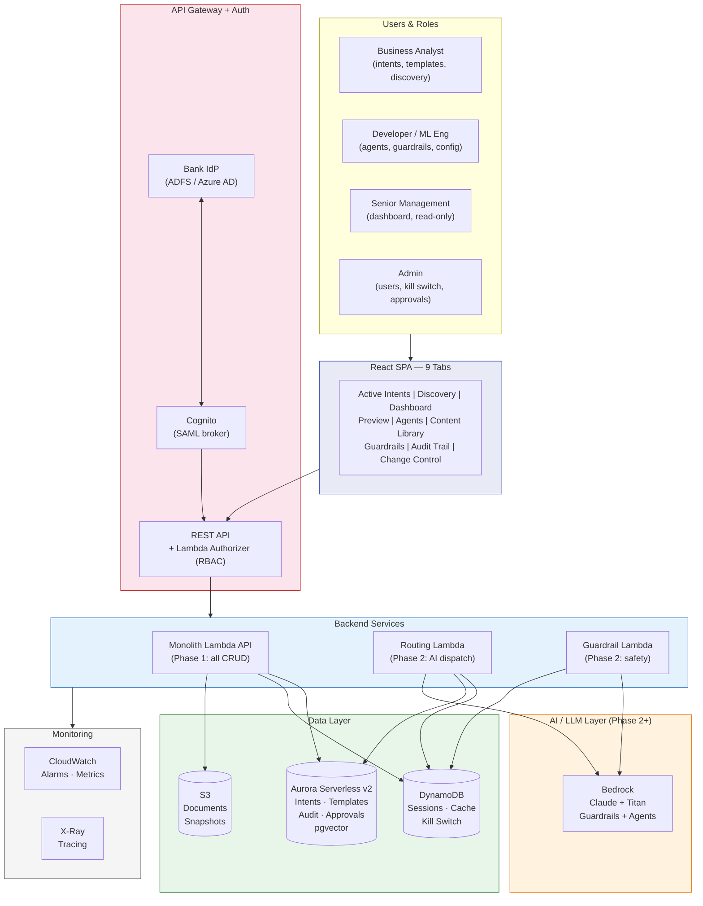

### 2.1 Data Architecture

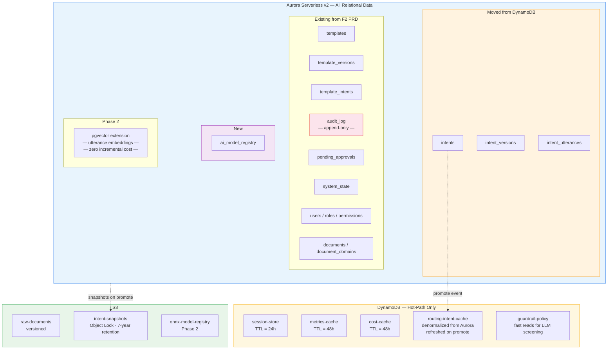

**Why intents move to Aurora:**
- Admin UI needs multi-column filtering (risk + mode + status + env) — relational queries
- Templates and intents share foreign-key relationships (junction table)
- Version history needs ordered range queries with ACID guarantees
- Routing engine uses a **denormalized DynamoDB cache** (refreshed on promote) for sub-millisecond reads — best of both worlds

**Why pgvector replaces OpenSearch Serverless:**
- Aurora PostgreSQL supports pgvector natively (zero incremental cost)
- Adequate for <100K utterance vectors at this scale
- Saves $4,200-8,400/year in infrastructure
- Clear migration path to OpenSearch if volume demands it

### 2.2 Auth Architecture

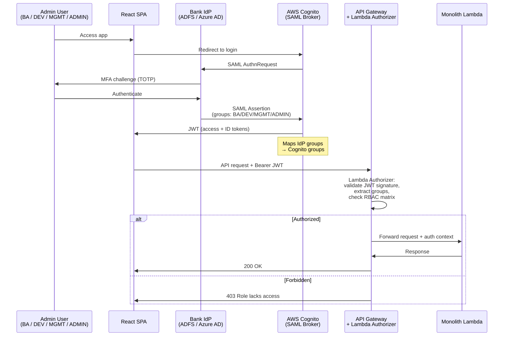

**RBAC Matrix:**

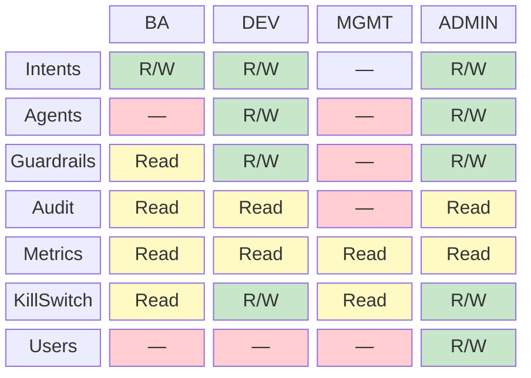

**Default posture: SAML federation.** Cognito is the token broker, not the identity source. The bank's existing IdP handles authentication and MFA. If bank confirms no existing IdP (unlikely for OCBC), fall back to Cognito-native auth.

### 2.3 Lambda Architecture (Progressive Decomposition)

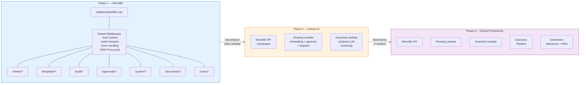

### 2.4 CI/CD Architecture

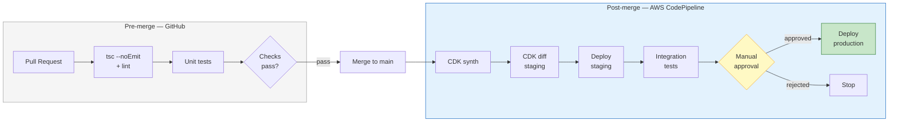

**Decision point:** If bank security approves GitHub Actions with OIDC federation (no long-lived credentials), it can handle the full pipeline. If not (likely), CodePipeline handles all post-merge deployment.

### 2.5 Data Classification

| Data Category | Examples | Sensitivity | Retention | Encryption | Access |
|---------------|---------|-------------|-----------|------------|--------|
| **Chatbot Configuration** | Intents, templates, agent configs, guardrail policies | Internal | Indefinite | AES-256 at rest, TLS in transit | BA, DEV, ADMIN |
| **Audit Logs** | Who changed what, when, before/after state | Confidential | 7 years (MAS) | AES-256, immutable | BA (read), DEV (read), ADMIN (read), Auditors |
| **System State** | Kill switch, feature flags | Internal | Current only | AES-256 | DEV, ADMIN |
| **Session Data** | Conversation history, routing traces | Confidential (may contain PII) | 24 hours (TTL) | AES-256, auto-deleted | System only |
| **Knowledge Documents** | Product guides, policy PDFs | Internal / Confidential | Per document lifecycle | AES-256, versioned in S3 | BA, DEV, ADMIN |
| **AI Model Metadata** | Model IDs, versions, risk assessments | Internal | Indefinite | AES-256 | DEV, ADMIN, MGMT (read) |
| **Cost / Metrics** | Bedrock token usage, query volumes | Internal | 90 days (cache), indefinite (aggregated) | AES-256 | MGMT (read), DEV, ADMIN |

### 2.6 Key Workflow: Maker-Checker (Intent Promotion)

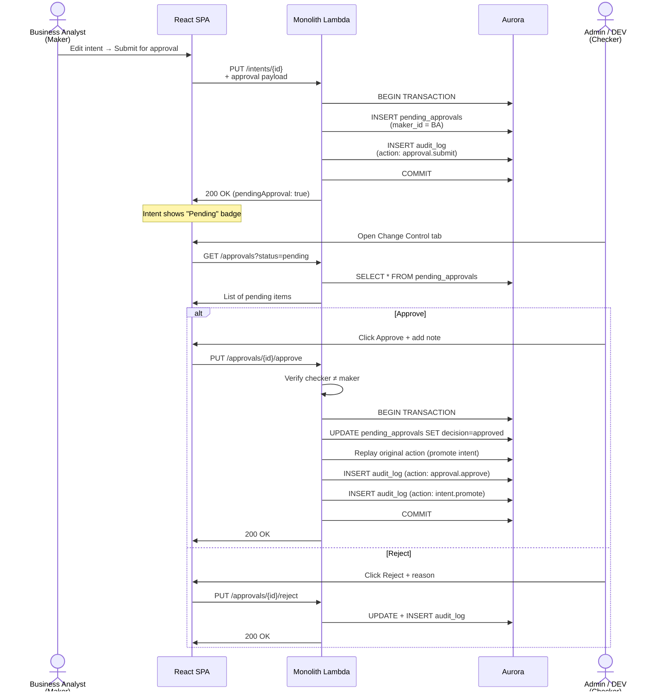

### 2.7 Key Workflow: Query Routing (Phase 2)

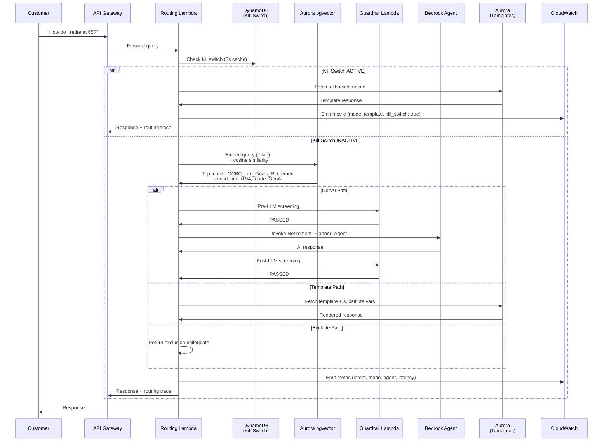

---

## Part 3: Banking Reality Adjustments

### 3.1 The Hidden Critical Path — Procurement Timeline

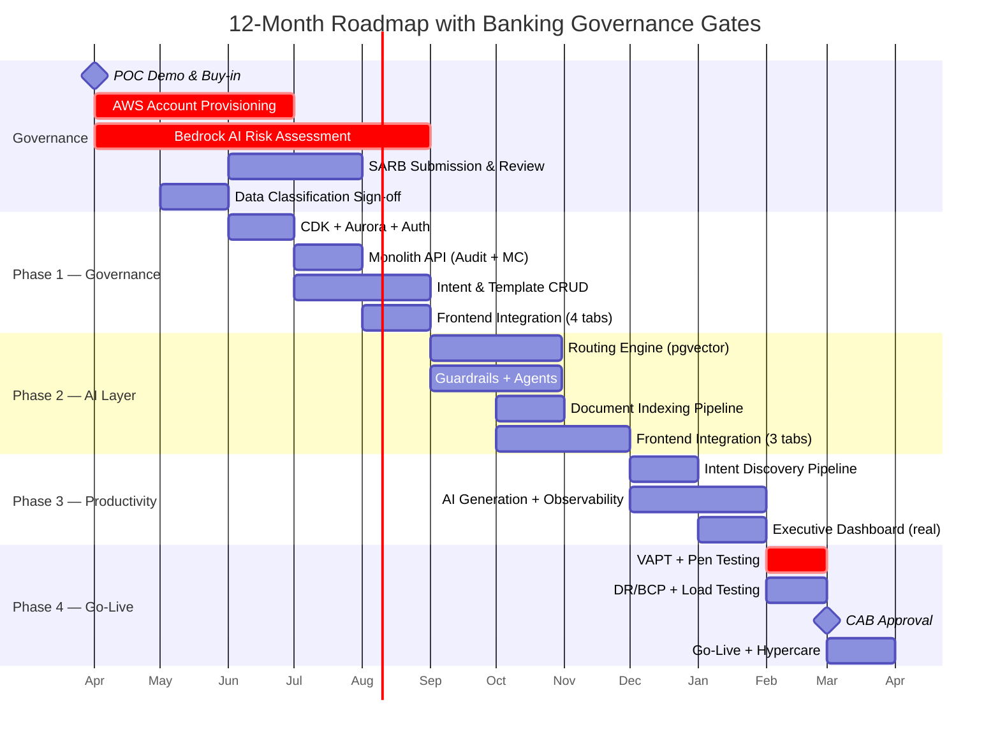

**Key dependency:** Phase 2 (AI) cannot start until Bedrock approval completes. Phase 1 (governance) proceeds independently — this is not idle time, it delivers real compliance value.

**Critical insight:** Phase 1 (governance + CRUD) can start 2-3 months before Bedrock is approved. This is not idle time — it delivers real value (audit trail, maker-checker, intent management) and satisfies MAS compliance requirements independently of AI.

### 3.2 Intent Lifecycle (Core Business Workflow)

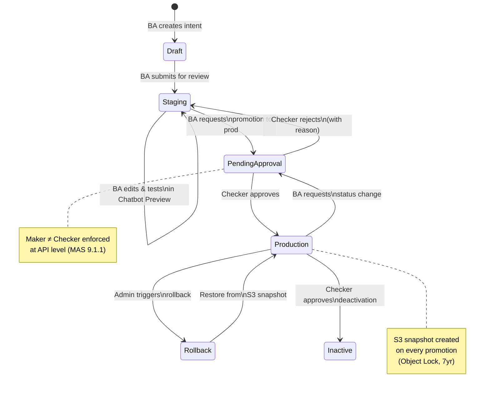

### 3.3 What the POC Buys You Right Now

The POC is not throwaway work. It serves three purposes:

1. **Immediate (Month 0):** Senior management demo to secure budget and AWS buy-in. Every tab demonstrates a real capability. The mock data tells a coherent story about governance, compliance, and AI-assisted operations.

2. **Medium-term (Months 2-5):** Functional specification for the backend API. Every mock data shape in every component IS the future API response contract. The POC is the spec.

3. **Long-term (Months 5+):** The React SPA becomes the actual production frontend. The Phase 2 frontend tasks wire each component to real APIs — replacing mock data, not rewriting components.

### 3.4 Avoiding the Pilot Trap

Industry data shows 75% of banking chatbot implementations get stuck in siloed pilots. Only 5% deliver measurable P&L impact (MIT, 2025). The strategy to avoid this:

- **Build the platform first, then plug in AI.** The governance, audit, and multi-use-case infrastructure serves retirement planning first, but the architecture (use-case namespacing, pluggable providers) supports loans, cards, wealth without rearchitecture.

- **Each phase delivers a standalone usable system**, not a half-built bridge. Phase 1 alone is a fully compliant intent management + approval system — useful even without AI.

- **Cost visibility from Phase 2 onward.** Management sees per-agent cost attribution, not a single Bedrock bill. This prevents the "AI is too expensive, kill it" knee-jerk reaction.

---

## Part 4: Phased Roadmap

### Phase Dependency Map

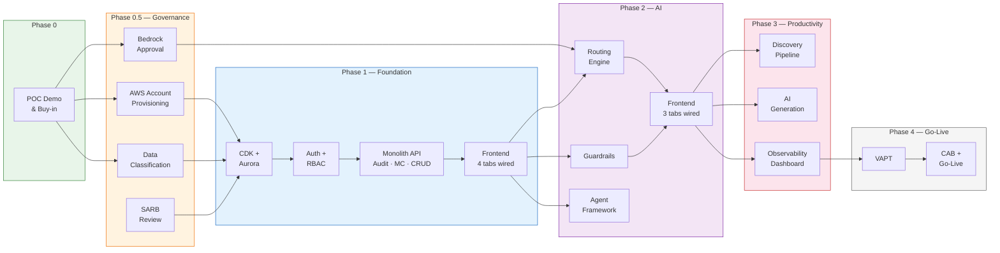

### Phase 0: Demonstrate Value (Week 0 — NOW)

**Deliverable:** Management buy-in and budget approval.

| Action | Detail |
|--------|--------|
| Demo the POC | Use existing Firebase deployment. Walk through all 9 tabs: maker-checker flow, audit trail, guardrails, intent lifecycle, executive dashboard. |
| Prepare AWS buy-in narrative | Cost projections (Part 5). MAS TRM alignment (Part 7). Build-vs-buy analysis. |
| Start procurement paperwork | AWS account request to Cloud CoE. Bedrock AI risk assessment intake form. |
| Identify bank's IdP | Confirm ADFS / Azure AD / Okta. This determines auth architecture. |

**Cost:** $0. **Team:** PM + presenter.

---

### Phase 0.5: Governance Track (Months 1-4, PARALLEL with Phase 1 design)

**Deliverable:** All procurement approvals needed for Phase 1 + Phase 2.

| Activity | Owner | Duration | Notes |
|----------|-------|----------|-------|
| AWS account provisioning | Cloud CoE | 2-4 months | Longest lead item — submit first |
| Bedrock AI risk assessment | Risk / Compliance | 3-6 months | Gates Phase 2, not Phase 1 |
| Data classification sign-off | Data Governance | 4-6 weeks | Use table in Section 2.5 |
| SARB submission | Architecture team | 6-8 weeks | This document is the input |
| MAS FEAT self-assessment | Compliance | Ongoing | Leverage OCBC's Veritas pilot |
| AI Model Governance framework | Risk / ML team | 4-8 weeks | MAS Nov 2025 requirement |
| IdP federation agreement | IAM / Security | 2-4 weeks | SAML metadata exchange |

**Cost:** $0 (governance work, not infrastructure). **Team:** PM + Compliance + Architecture.

---

### Phase 1: Governance Foundation (Months 2-5)

**Gate:** AWS accounts provisioned.

**Deliverable:** *"Every change is tracked and approved. Business analysts can manage intents and templates. Fully MAS-compliant governance layer."*

| Component | Scope | PRD Reference |
|-----------|-------|--------------|
| CDK scaffolding | Single stack initially. Aurora + DynamoDB + S3 + API Gateway. | F1 (revised) |
| Aurora schema | All tables from F2 PRD + intents (moved from DynamoDB) + AI Model Registry (new). pgvector extension enabled. | F2 (expanded) |
| Auth | Cognito as SAML broker. Lambda authorizer with RBAC. 4 roles. | F3 (revised) |
| Monolith Lambda API | Single handler. Routes: `/intents`, `/templates`, `/audit`, `/approvals`, `/system`, `/documents`, `/users`. | New (consolidates I1, T1, A1, MC1, DOC1) |
| Frontend integration | Wire 4 tabs to real API: **Active Intents**, **Content Library**, **Audit Trail**, **Change Control**. Remove mock data. | FE1, FE6, FE8 |

**Not in Phase 1:** Routing engine, AI generation, discovery pipeline, agents, LLM-based guardrails, real-time observability, chatbot preview with real routing. All require Bedrock.

**Team:** 1 full-stack developer + 1 DevOps/cloud engineer.
**Monthly AWS cost:** ~$300-700.

---

### Phase 2: Intelligence Layer (Months 5-8)

**Gate:** Bedrock approval completed.

**Deliverable:** *"The chatbot routes customer queries with AI. Guardrails prevent unsafe responses. BAs can preview real routing behavior."*

| Component | Scope | PRD Reference |
|-----------|-------|--------------|
| Routing engine | Embed query (Bedrock Titan) → cosine similarity (pgvector) → intent match → dispatch to GenAI / Template / Exclude. Kill switch integration. Routing trace. | R1 |
| Guardrails | Bedrock Guardrails (primary) + application-level rules. Pre-LLM input + post-LLM output screening. | GD1 |
| Agent framework | Bedrock Agents (one per domain). Config in DynamoDB. Session store with 24h TTL. | AG1 |
| Document indexing | S3 upload → processing → Bedrock Titan embeddings → pgvector. Status tracking. | DOC2 |
| DynamoDB routing cache | Denormalized intent lookup for sub-ms routing reads. Refreshed on promote. | New |
| Frontend integration | Wire: **Chatbot Preview**, **Active Agents**, **Guardrails Config**. | FE4, FE5, FE7 |

**Team:** Add 1 ML/AI engineer (total: 2 devs + 1 DevOps).
**Monthly AWS cost:** ~$800-2,000.

---

### Phase 3: AI Productivity + Observability (Months 8-10)

**Deliverable:** *"AI assists BAs in discovering and generating intents. Management has full visibility into cost, performance, and quality."*

| Component | Scope | PRD Reference |
|-----------|-------|--------------|
| Intent Discovery pipeline | Upload docs → Claude extracts intents → generate diffs → review → promote to staging. | D1 |
| AI generation | Utterance generation + RAG response drafting. Draft-only (human review required). | G1 |
| Observability | CloudWatch custom metrics + Cost Explorer cache + dashboard API. Per-agent cost attribution. | OBS1 |
| Frontend integration | Wire: **Intent Discovery**, **Executive Dashboard** (real metrics). | FE2, FE3 |
| pgvector evaluation | If routing p95 > 200ms or intent count > 50K → plan migration to managed OpenSearch. | Decision point |

**Team:** Same as Phase 2.
**Monthly AWS cost:** ~$1,000-2,500.

---

### Phase 4: Hardening + Go-Live (Months 10-12)

**Deliverable:** *"Production-ready system with MAS compliance documentation."*

| Activity | Detail |
|----------|--------|
| VAPT / penetration testing | External firm. 2-6 weeks + remediation. |
| Performance / load testing | All APIs at 10x expected traffic. Aurora burst behavior. |
| DR/BCP procedures | Runbooks. Aurora failover test. S3 cross-region verification. Backup restoration test. |
| MAS TRM compliance package | Map every control to platform component. Exportable audit evidence. |
| MAS FEAT self-assessment | Document fairness, accountability, transparency controls. |
| AI Model Governance | Complete AI Inventory. Materiality assessments for Claude + Titan. |
| CAB submission + approval | Change Advisory Board review for production. |
| Go-live + hypercare | 4-week hypercare with on-call rotation. |

**Team:** Add 1 security/compliance consultant (contract, 2-3 months).
**Monthly AWS cost:** ~$1,000-2,500.

---

## Part 5: Cost Projections

### Monthly AWS Cost by Phase

| Service | Phase 1 | Phase 2 | Phase 3+ | Notes |
|---------|---------|---------|----------|-------|
| Aurora Serverless v2 (staging) | $50 | $50 | $50 | 0.5 ACU idle |
| Aurora Serverless v2 (prod) | $200-500 | $200-500 | $200-500 | 1-4 ACU variable |
| RDS Proxy | $50-100 | $50-100 | $50-100 | Per-instance |
| DynamoDB (on-demand) | $20-50 | $30-80 | $30-80 | Admin tool traffic |
| API Gateway | $10-30 | $20-50 | $20-50 | REST API |
| Lambda | $5-20 | $20-80 | $30-100 | Compute |
| S3 | $5-15 | $10-20 | $10-20 | Documents + snapshots |
| CloudWatch / X-Ray | $20-50 | $30-80 | $30-80 | Logs + metrics + traces |
| Bedrock (Claude) | — | $200-1,000 | $200-1,000 | Per-token, volume dependent |
| Bedrock (Titan Embeddings) | — | $50-200 | $50-200 | Per-embedding call |
| pgvector (in Aurora) | $0 | $0 | $0 | Extension, no extra cost |
| OpenSearch Serverless | — | — | $350-700 | Only if pgvector insufficient |
| **TOTAL** | **$300-700** | **$600-2,000** | **$800-2,500** | |

### Cost Growth by Phase

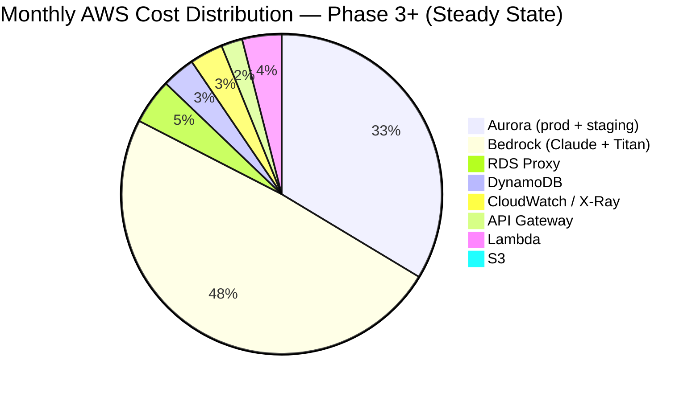

### Annual Summary

| Phase | Monthly Range | Annual Range |
|-------|-------------|-------------|
| Phase 1 (governance, no AI) | $300-700 | $3,600-8,400 |
| Phase 2 (with AI) | $600-2,000 | $7,200-24,000 |
| Phase 3+ (full platform) | $800-2,500 | $9,600-30,000 |

**For management:** Infrastructure cost is $10-30K/year. The dominant cost is personnel. Two developers for 12 months costs significantly more than AWS.

### Cost Optimization Decisions

| Decision | Annual Saving | Trade-off |
|----------|--------------|-----------|
| pgvector instead of OpenSearch Serverless | $4,200-8,400 | Migrate later if needed |
| Monolith Lambda instead of 15 micro-Lambdas | Fewer cold starts, simpler ops | Decompose in Phase 2 |
| Aurora Serverless v2 instead of provisioned RDS | ~50% during off-hours | 0.5 ACU minimum |
| DynamoDB on-demand (not provisioned) | No capacity planning | Slightly higher per-request |

### Team Composition

| Role | Phase 1 | Phase 2 | Phase 3 | Phase 4 |
|------|---------|---------|---------|---------|
| Full-stack developer | 1 | 1 | 1 | 1 |
| DevOps / Cloud engineer | 1 | 1 | 1 | 1 |
| ML / AI engineer | — | 1 | 1 | 1 |
| Security consultant (contract) | — | — | — | 1 |
| **Total** | **2** | **3** | **3** | **4** |

---

## Part 6: Risk Register

### Risk Heatmap

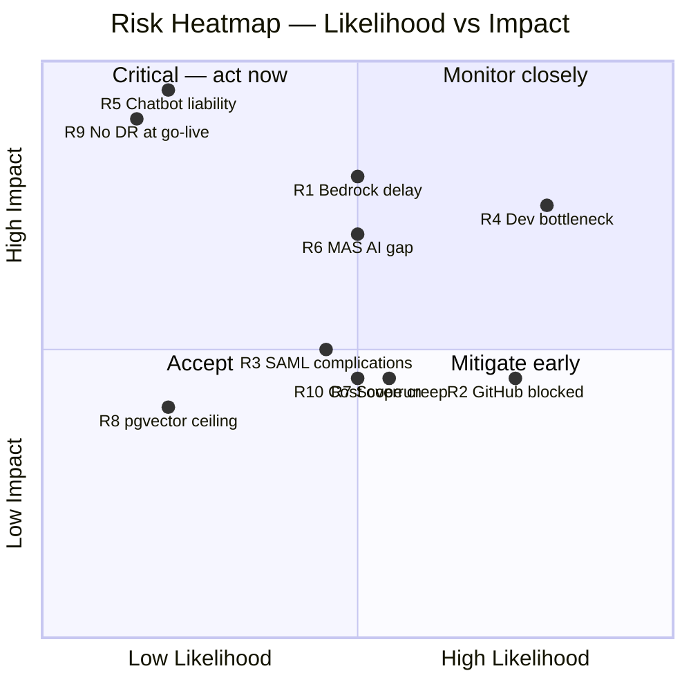

| # | Risk | Likelihood | Impact | Mitigation |
|---|------|-----------|--------|------------|
| R1 | **Bedrock approval delayed >6 months** | Medium | High — blocks all AI features | Phase 1 delivers full governance value without AI. Escalate through AWS account team. Pluggable provider pattern supports Azure OpenAI as fallback. |
| R2 | **Bank blocks GitHub Actions** | High | Medium — CI/CD rearch | Design CodePipeline as default. GitHub Actions for pre-merge only. |
| R3 | **SAML IdP integration complications** | Medium | Medium — delays auth | Start IdP discovery in Phase 0 (NOW). Design SAML broker as default. |
| R4 | **Single developer bottleneck** | High | High — delivery risk | Genuine re-tiering (6 tasks in Phase 1, not 15). Monolith Lambda reduces scope. Each phase is independently shippable. |
| R5 | **Chatbot liability (Air Canada scenario)** | Low | Critical — legal + regulatory | Guardrails in Phase 2. Kill switch from Phase 1. Template responses for high-risk intents. Maker-checker on all AI changes. Exclusion for sensitive topics. |
| R6 | **MAS AI governance gap** | Medium | High — supervisory | AI Model Registry in Phase 1 schema. FEAT self-assessment in Phase 0.5. OCBC's Veritas pilot is an advantage. |
| R7 | **Scope creep to multi-use-case** | Medium | Medium — delays delivery | Ship retirement planning end-to-end first. Architecture supports multi-use-case (namespacing) but implementation stays single-use-case until Phase 3+. |
| R8 | **pgvector performance ceiling** | Low | Medium — routing latency | Monitor p95. Migration path to OpenSearch documented. Decision point at Phase 3 end. |
| R9 | **No DR at go-live** | Low (if planned) | Critical | Define RTO/RPO in Phase 1 design. Aurora Multi-AZ. S3 cross-region replication. Runbook in Phase 4. |
| R10 | **Bedrock cost overrun** | Medium | Medium — budget | Per-agent cost attribution. Daily cost cache. AWS Budget alerts. Application-level throttling. Template fallback for cost-sensitive intents. |

---

## Part 7: MAS Compliance Mapping

### 7.1 MAS TRM 2021

| MAS TRM Section | Requirement | Platform Component | Phase |
|-----------------|-------------|-------------------|-------|
| **9.1.1** | Segregation of duties, "never alone" | Maker-checker workflow. Self-approval rejected at API level. | 1 |
| **9.1.3** | Audit logging of user activities | Append-only `audit_log`. DELETE/UPDATE revoked at DB level. | 1 |
| **9.1.3** | Privileged users cannot access own logs for tampering | RBAC enforcement. Audit log DELETE revoked for all roles. | 1 |
| **9.1.6** | Encryption of confidential data | AES-256 at rest. TLS in transit. IAM auth (no passwords). | 1 |
| **11.1** | Data classification and protection | Classification table (Section 2.5). Sensitivity-based controls. | 0.5 |
| **12.2.2** | Log integrity and retention | S3 Object Lock (7-year). Audit table immutability. | 1 |
| **11.3.2** | Change management controls | Kill switch + maker-checker + audit. All changes require approval. | 1 |
| **13.1** | Technology risk management | Kill switch (global + per-agent). Guardrails. Routing trace. | 1-2 |
| **10.2** | Cloud outsourcing governance | Multi-account. Data residency (ap-southeast-1). Shared responsibility. | 0.5 |
| **13.2** | Annual VAPT | Penetration testing + remediation. | 4 |

### 7.2 MAS November 2025 AI Risk Management Consultation

| Requirement | Platform Component | Phase |
|-------------|-------------------|-------|
| **AI Inventory** | `ai_model_registry` table. Tracks: model, provider, purpose, materiality, version. | 1 (schema), 2 (data) |
| **Materiality tiering** | `materiality_tier` field. Retirement chatbot = High (customer-facing). | 2 |
| **Lifecycle controls** | Agent config versioning. System prompts in S3 (versioned). Full audit trail. | 2 |
| **Board accountability** | Executive Dashboard with AI usage, cost, quality metrics. | 3 |
| **Independent validation** | Chatbot Preview (staging-only). Guardrail test mode. Routing trace. | 2 |

### 7.3 FEAT Principles

| Principle | How Addressed | Phase |
|-----------|--------------|-------|
| **Fairness** | Guardrails screen for discriminatory outputs. Templates ensure consistent treatment. | 2 |
| **Ethics** | Maker-checker on all AI changes. Human escalation. Kill switch. AI drafts require human approval. | 1 (governance), 2 (AI) |
| **Accountability** | Full audit trail. Every AI change attributed to a human. AI Model Registry. OCBC remains responsible (Principle 8). | 1 (audit), 2 (registry) |
| **Transparency** | Routing trace shows how queries are handled. Dashboard shows AI usage + cost. Bot discloses it is AI. | 2 (trace), 3 (dashboard) |

---

## Part 8: Decision Log (Requires Stakeholder Input)

These decisions cannot be made by the development team alone.

| # | Decision | Options | Stakeholder | Urgency |
|---|----------|---------|------------|---------|
| D1 | **Identity provider** | (a) SAML federation with ADFS/Azure AD via Cognito *(recommended)* (b) Cognito-native | IAM / Security | **Phase 0** |
| D2 | **CI/CD platform** | (a) CodePipeline/CodeBuild *(recommended)* (b) GitHub Actions with OIDC | Security team | **Phase 0.5** |
| D3 | **Data classification** | Submit table (Section 2.5) for sign-off | Data Governance | **Phase 0.5** |
| D4 | **Bedrock risk classification** | Submit AI usage proposal | Risk / Compliance | **Phase 0.5** |
| D5 | **KMS CMK vs AWS-managed keys** | (a) AWS-managed Phase 1, CMK Phase 2 *(recommended)* (b) CMK from day one | Security team | **Phase 1** |
| D6 | **Multi-account vs single-account** | (a) Separate accounts *(recommended)* (b) Single account | Cloud CoE | **Phase 0.5** |

---

## Appendix A: Existing Asset Inventory

| Asset | Location | Status |
|-------|----------|--------|
| POC React SPA (9 tabs) | `src/components/*.tsx` | Complete, mock data |
| Infrastructure PRD | `docs/prd/F1-infrastructure.md` | Needs revision per this document |
| Aurora Schema PRD | `docs/prd/F2-aurora-schema.md` | Needs expansion (intents + AI registry) |
| Auth/RBAC PRD | `docs/prd/F3-auth-rbac.md` | Needs revision (SAML default) |
| Frontend PRDs (8) | `docs/prd/FE1-FE8*.md` | Complete, backend-ready |
| Master Plan (SSOT) | Tracked separately | Needs re-tiering |
| Task Index | `AGENT_TASKS.md` | Needs re-tiering |

## Appendix B: Files to Modify When Implementing

| File | Change Required | Phase |
|------|----------------|-------|
| `docs/prd/F1-infrastructure.md` | Remove intent-db from DynamoDB. Add routing-intent-cache. Change CI/CD to CodePipeline. Consolidate Lambda roles. | 1 |
| `docs/prd/F2-aurora-schema.md` | Add intents + intent_versions + intent_utterances tables. Add `ai_model_registry`. Enable pgvector. | 1 |
| `docs/prd/F3-auth-rbac.md` | Elevate SAML federation to default architecture. Update Cognito config. | 1 |
| `AGENT_TASKS.md` | Re-tier: consolidate Phase 1 to 6 tasks. Move AI to Phase 2. Add Phase 0.5 governance tasks. | 0 |

## Appendix C: Research Sources

- MAS TRM Guidelines (January 2021): Technology risk management framework
- MAS Consultation Paper on AI Risk Management Guidelines (November 2025)
- MAS FEAT Principles (2018) + Veritas Initiative
- AWS Well-Architected Framework — Financial Services Industry Lens (2024)
- AWS/Anthropic Financial Services Guide for AI Agents
- Richmond Fed: AI and Operational Losses in Banking (2025)
- MIT: AI Implementation Success Rates (2025)
- Air Canada v. Moffatt: Chatbot liability case law
