# Chatbot Backoffice Platform — Functionality Guide

> A unified admin control interface for managing AI chatbot intents, agents, guardrails, and compliance.
>
> **Date:** 2026-03-29
> **Version:** 2.0
> **Audience:** Senior Management (executive summary) | Product & Tech Leads (detailed walkthroughs)
> **Related:** [Vendor-Agnostic Strategy](STRATEGY_VENDOR_AGNOSTIC.md) for architecture and compliance details

---

## 1. Executive Overview

### What This Platform Is

A **governance-first admin control interface** for managing an AI-powered customer-facing chatbot. It provides Technical BAs with a controlled workspace to configure the chatbot, with management and admin oversight, and view-only access for general business staff and developers:

- Define and manage what the chatbot knows (intents, templates, knowledge documents)
- Configure how the chatbot responds (AI agents, routing rules, response modes)
- Control what the chatbot is allowed to say (guardrails, blocked topics, sensitivity levels)
- Monitor how the chatbot performs (query volume, cost per agent, customer satisfaction)
- Enforce compliance at every step (maker-checker approvals, immutable audit trail, emergency kill switch)

### Why It Matters

Every configuration change to a customer-facing AI chatbot in a regulated bank must be **tracked, approved, and auditable**. This platform ensures:

- **No change goes unreviewed** — maker-checker approval on all writes (MAS TRM 9.1.1)
- **No action goes unrecorded** — immutable audit trail with 7-year retention (MAS TRM 12.2.2)
- **AI can be stopped via kill switch** — global kill switch (with maker-checker approval) falls back to safe template responses
- **Cost is visible** — per-agent cost attribution prevents budget surprises

### Platform at a Glance

- **11 functional modules** across 3 domains
- **5 user roles** with least-privilege access (1 maker, 3 reviewers/viewers, 1 admin)
- **15 approval action types** requiring maker-checker sign-off
- **Full audit trail** of every system action

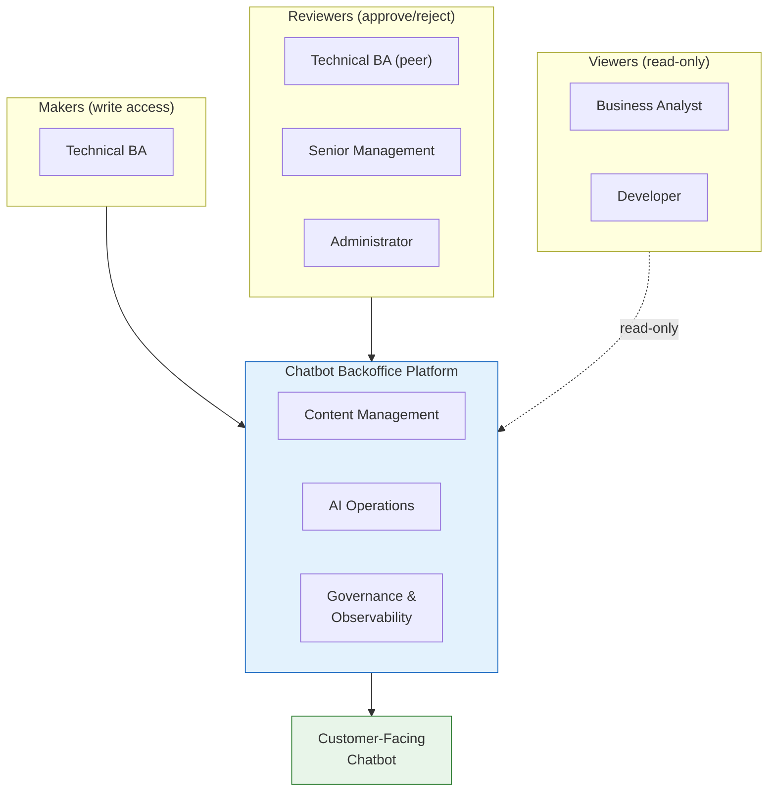

---

## 2. Platform Modules

The 11 modules are organized into three functional domains. Every write operation flows through the maker-checker approval system, and every action is recorded in the audit trail.

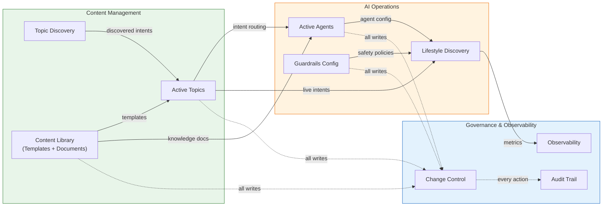

### 2.5 Navigation & Layout

The platform uses a **collapsible sidebar** (expanded: 288px, collapsed: 80px) with two navigation tiers:

**Primary navigation** (always visible):
- Lifestyle Discovery — AI-powered lifestyle profiling and product recommendations
- Active Topics — manage production intents
- Observability — dashboards, metrics, kill switch controls
- Topic Discovery — AI-powered intent creation and promotion

**Secondary navigation** (under expandable "More" section):
- Active Agents — AI agent configuration
- Content Library — templates and knowledge documents
- Audit Trail — immutable compliance log
- Change Control — maker-checker approval queue

**Header indicators:**
- **Kill switch status** — pulsing red badge when active, green "System Secure" when inactive
- **System status** — "GenAI Disabled" (red) when kill switch active, "System Secure" (green) normally
- Notification bell, settings icon, breadcrumb navigation

This navigation hierarchy places the most-used operational views (benchmarking, intent management, monitoring, discovery) in primary position, with governance and configuration tools accessible under "More".

---

## 3. Module Walkthroughs

### 3.1 Active Topics — *Manage existing intents*

**Primary users:** Technical BA (edit) | BA, DEV (view-only)

An intent represents a customer question the chatbot can handle (e.g., "How do I retire at 65?"). This module manages **existing intents** — editing their configuration, monitoring their status, and maintaining per-intent version history. New intent creation and production promotion happen in Topic Discovery (Section 3.2).

**What users can do:**
- Filter and search intents by name, risk level, response mode, and status
- View status badges per intent (PENDING or PROD)
- View risk level per intent (High or Low) with visual indicators
- Edit existing intents: name, utterances (add/remove manually), response text
- Select response mode per intent: **GenAI** (AI-generated), **Template** (fixed text), or **Exclude** (blocked topic) — via inline toggle or edit modal
- Toggle intent status (active/inactive) — requires maker-checker approval
- View per-intent version history (who changed what, when)
- Restore to a prior version — requires maker-checker approval
- Delete intents (production intents only) — requires maker-checker approval

**Key workflow:**

1. Technical BA filters intents by risk level or response mode to find the intent to update
2. Technical BA opens the intent edit modal → modifies utterances or response text
3. Technical BA selects the appropriate response mode (GenAI / Template / Exclude)
4. Technical BA saves changes → change is submitted for approval
5. Checker reviews and approves or rejects in Change Control
6. Audit trail records every step; per-intent version history updated

**Business value:** Provides a centralized view of all chatbot intents with filtering and risk visibility. Per-intent version history enables rollback if a change causes issues — without affecting other intents.

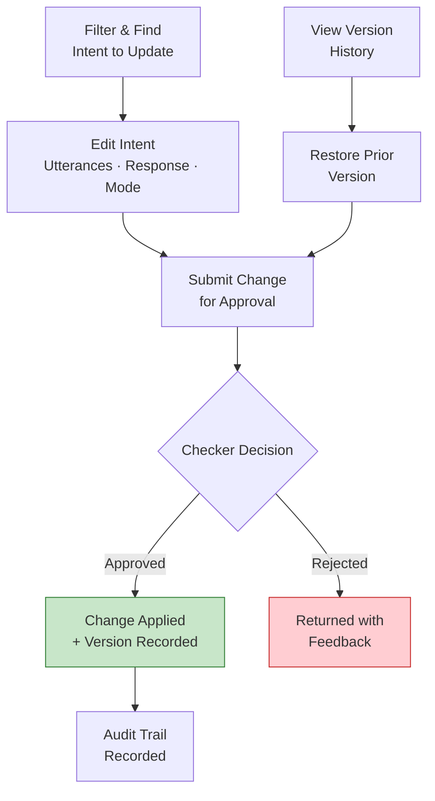

> [Screenshot: Active Topics — intent list with environment badges, risk indicators, and filter panel]

---

### 3.2 Topic Discovery — *Create, discover, and promote intents*

**Primary users:** Technical BA (edit) | BA, DEV (view-only)

The primary workflow for adding new intents and promoting them to production. Supports two paths: **AI-powered discovery** (upload documents and let AI identify intents) and **manual creation** (create intents directly). Also manages DB-level snapshots — immutable copies of the entire intent database at each production deployment.

**What users can do:**
- Upload knowledge sources: PDF, DOCX, URL, or folder
- Trigger AI-powered discovery to detect new, modified, and deleted intents with confidence scores (TBD)
- Manually create new intents via the "New Intent" form (name, utterances, response, response mode)
- Use AI-assisted generation for both utterances and response drafting
- Review and edit diffs inline before accepting (modify utterances, responses)
- Approve selected diffs as pending changes (individually or batch)
- Compare pending changes vs production side-by-side
- Batch promote pending intents to production — requires checker approval
- View **DB-level version snapshots** (v1, v2, v3) — each snapshot captures the entire intent database state at promotion time
- Restore to a prior DB snapshot (rollback entire database state) — requires approval

**Key workflow:**

1. Technical BA uploads new/updated product document (e.g., revised retirement planning guide)
2. System generates intent diffs: "3 new intents detected, 2 modified, 1 deleted" with confidence scores
3. Technical BA reviews each diff — edits utterances and responses inline (with AI-assisted suggestions)
4. Technical BA accepts selected diffs → intents saved as pending changes
5. Technical BA tests in Bot Tech Benchmark using "Preview My Pending Changes" mode (overlays only this user's pending changes on top of production — other makers' pending changes are excluded)
6. Technical BA submits batch promotion to production
7. Checker approves; system creates immutable DB snapshot (Object Lock, 7-year retention)

**Business value:** Reduces manual effort to keep chatbot knowledge current. When product policies change, AI identifies which intents need updating — instead of manually comparing documents line by line. DB-level snapshots provide a safety net: if a batch promotion causes issues, the entire database can be rolled back to the prior state.

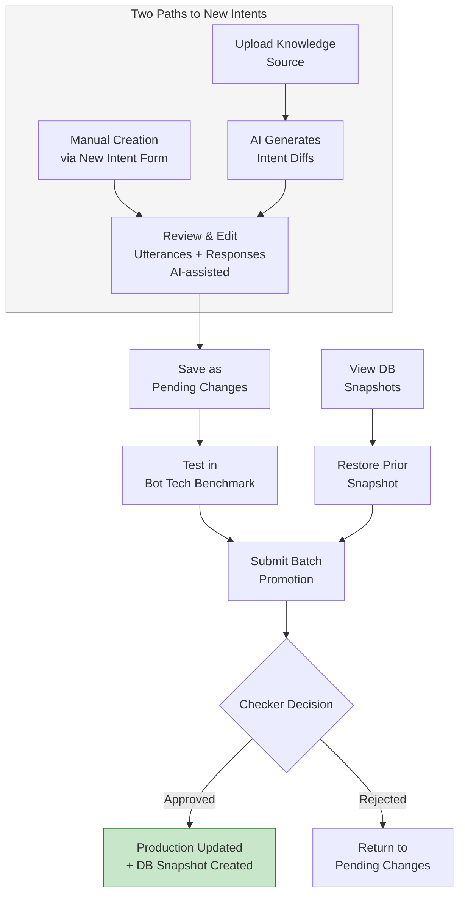

> [Screenshot: Topic Discovery — diff review panel with confidence scores, AI suggestions, and DB snapshot history]

---

### 3.3 Observability — *Operational intelligence and monitoring*

**Primary users:** All roles (read-only) | MGMT's primary view

Real-time operational view of chatbot performance, cost, and health. Designed for management reporting and operational monitoring — with direct kill switch controls for emergency response.

**What users can do:**
- Filter by time period (7 days / 30 days) and project domain (Retirement Planning / Home Loans / Card Services / All)
- View hero banner with trending insights (e.g., "340% spike in OCBC 360 queries") and actionable "Review Policy" buttons
- View KPI cards: total query volume, customer satisfaction trend, trending topics
- Review per-agent performance: sessions handled, fallback rate, latency, satisfaction sparklines
- Analyze cost intelligence: per-agent cost, cost per 1,000 queries, month-over-month trend, projected annual cost
- View guardrails monitor: hallucinations detected (count + percentage), successful blocks, risk/injection attempts
- Monitor intent distribution (pie chart) and guardrail metrics (queries screened, blocks, injection attempts)
- Activate/deactivate the kill switch directly from the dashboard (with confirmation dialog — creates approval + audit event)
- Check kill switch status at a glance
- Export dashboard as PDF (via print dialog with optimized print CSS)
- Navigate directly to Topic Discovery ("Generate New Intent" button) or Active Topics ("View Active Intents" button)

**Key workflow:**

1. Management opens dashboard → views hero banner (e.g., "340% spike in OCBC 360 queries") → clicks "Review Policy"
2. Selects project domain filter → narrows to Retirement Planning
3. Drills into agent performance table → identifies high-fallback agent
4. Reviews cost projection → confirms monthly cost and projected annual cost are on track
5. Checks guardrails monitor → notes increase in hallucination detections and blocked queries
6. If anomaly is critical, activates kill switch directly from dashboard → confirmation dialog → approval submitted
7. Exports dashboard as PDF for monthly reporting

**Business value:** Gives management visibility into AI operations without requiring technical knowledge. Per-agent cost attribution prevents the "AI is too expensive, shut it down" reaction by showing exactly where costs originate. Kill switch controls on the dashboard allow immediate emergency response without navigating to Change Control.

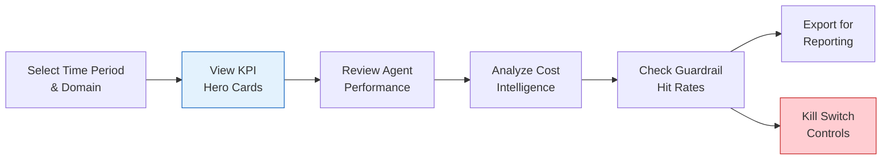

> [Screenshot: Observability — KPI cards, agent performance table, cost intelligence, kill switch controls]

---

### 3.4 Lifestyle Discovery — *AI-powered personalized retirement profiling*

**Primary users:** All roles (evaluation/demo) | MGMT (use case validation) | Technical BA (configuration review)

An image-based lifestyle assessment tool that helps customers identify their retirement aspirations. Users engage with lifestyle imagery and AI classifies their preferences into a retirement spending profile, generating personalized product recommendations.

The specific classification approach (image classifier model, vision-capable LLM, or hybrid) is TBD based on accuracy requirements and vendor selection. The user experience presents two parallel approaches:

- **Vision Upload:** User uploads a lifestyle photo → AI classifies their retirement profile with reasoning and personalized advice
- **Visual Picker:** User browses and selects from a curated image pool → AI determines profile from selections with product recommendations

Both approaches produce: a tier classification, reasoning narrative, and product recommendations.

**What users can do:**
- Browse and interact with the lifestyle image picker interface
- Upload a personal lifestyle photo for AI classification
- View the AI-generated tier classification with reasoning
- See product recommendations tailored to the classified lifestyle tier
- Observe how the system handles edge cases and uncertain classifications

**Kill switch behavior:** When the kill switch is active, the system falls back to the Visual Picker approach — removing the AI-powered Vision Upload path and presenting users with the manual picker only.

**Key workflow:**

1. User opens Lifestyle Discovery
2. Selects images from the Visual Picker that reflect their retirement aspirations, or uploads a personal photo
3. AI analyzes selections → returns a lifestyle tier classification with reasoning
4. User receives personalized product recommendations aligned to their retirement profile
5. User can retry or explore alternative selections

**Business value:** Demonstrates how AI can personalize financial product recommendations based on inferred customer preferences — a high-value cross-selling use case. The image-based interface is more engaging than traditional questionnaires and captures implicit lifestyle preferences that customers may not articulate directly.

> [Screenshot: Lifestyle Discovery — image picker and Vision Upload side-by-side with tier classification result]

---

### 3.5 Active Agents — *Configure AI agent behavior*

**Primary users:** Technical BA (edit) | ADMIN (edit + approve) | BA, DEV (view-only)

Manages the AI agents that generate responses for GenAI-mode intents. Each agent is a configured LLM instance with its own system prompt, model parameters, and assigned intents. Technical BAs have full control over agent behavior through the platform — no developer deployment required.

Agents are pre-provisioned per domain (e.g., one agent per product area or customer journey), with the specific agent set determined by the bank's chatbot scope. The platform manages their configuration, not their creation.

**What users can do:**
- Search and filter agents by name, category, or description
- Edit agent system prompt (up to 4,000 characters) — defines the agent's personality, knowledge boundaries, and response style
- Select the AI model from configured options — trade-off between capability and cost/speed
- Adjust temperature (0.0-1.0) — lower = more deterministic, higher = more creative
- Set max tokens — controls response length
- Edit intent routing via checkbox editor — select which intents this agent handles
- Toggle agent status (Active/Inactive) — requires maker-checker approval
- View per-agent performance metrics: sessions handled, fallback rate %, average latency (ms), customer satisfaction score

**Key workflow:**

1. Technical BA notices Retirement_Planner has a 3.1% fallback rate in the Observability dashboard
2. Opens Active Agents → selects Retirement_Planner → reviews system prompt
3. Edits system prompt to better handle edge cases (e.g., CPF withdrawal at specific ages)
4. Adjusts temperature from 0.7 to 0.6 for more consistent responses
5. Submits config change for approval
6. Checker approves → new config takes effect immediately
7. Monitors performance metrics → fallback rate drops to 2.4%

**Business value:** Gives Technical BAs direct control over agent behavior without waiting for developer deployments. System prompt editing is the highest-leverage tuning mechanism — it can dramatically change response quality without model retraining. The per-agent performance metrics create a feedback loop: tune → deploy → measure → repeat.

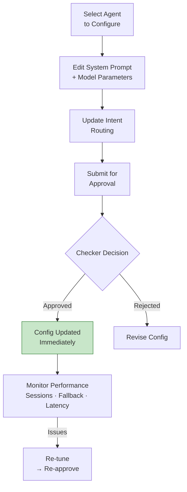

> [Screenshot: Active Agents — agent list with inline config editor, intent routing checkboxes, and performance metrics]

---

### 3.6 Content Library — *Templates and knowledge documents*

**Primary users:** Technical BA (edit) | BA, DEV (view-only)

Two-part module managing (a) response templates used for Template-mode intents, and (b) knowledge documents that feed the AI's understanding.

#### Templates

Templates are managed response texts linked to specific intents. The actual template set is determined by the bank's product and compliance requirements.

**What users can do:**
- Create and edit markdown templates with `{{variable}}` placeholders — variables are auto-extracted on save
- Preview template with sample variable substitution: `{{user_name}}` → "Ahmad Razali", `{{cpf_balance}}` → "S$128,450"
- View linked intents display — see which intents currently use this template
- Link templates to specific intents
- View version history with expandable rows: version number, timestamp, actor, change description, and restore button
- Publish templates via "Publish" button → confirmation → creates approval (actionType: `template.publish`)
- Restore prior template versions — requires maker-checker approval

#### Documents

Knowledge documents (PDF, DOCX, TXT, and URL sources) that feed the AI's retrieval-augmented generation. The document set grows as the bank's knowledge base expands.

**What users can do:**
- Upload knowledge documents via upload modal: drag-drop or file picker, file type selector, domain multi-select checkboxes
- Assign domain tags: Retirement Planning, Home Loans, Card Services, Compliance
- Monitor indexing status lifecycle: Pending (pulsing amber) → Indexed (emerald) | Failed (red) | Stale (gray)
- View chunk count per document (e.g., 47 chunks for a 2,840 KB PDF)
- View Indexing Hub sidebar: shows 5 recent indexing events with success/failure results
- Trigger re-indexing for stale or failed documents — requires approval
- Delete documents — requires approval
- Bulk re-index operations — requires approval

**Key workflow (Templates):**

1. Technical BA drafts template: "Your projected payout is {{payout_amount}} starting at age {{retirement_age}}"
2. System auto-extracts variables: `payout_amount`, `retirement_age`
3. Technical BA previews with sample data: "Your projected payout is S$1,850 starting at age 65"
4. Technical BA links template to intent "CPF_Payout_Inquiry"
5. Technical BA clicks "Publish" → confirmation dialog → approval created (actionType: `template.publish`)
6. Checker approves → template goes live
7. When intent matches in Template mode, variables are substituted from context

**Key workflow (Documents):**

1. Technical BA opens upload modal → drags updated product brochure PDF
2. Selects file type "PDF" → checks domain tags "Retirement Planning"
3. System indexes document: chunks content, generates embeddings → Indexing Hub sidebar shows progress
4. Status moves from Pending (pulsing amber) → Indexed (emerald) — chunk count: 47 chunks
5. AI agents can now reference this document in GenAI responses
6. Months later, document shows "Stale" status → Technical BA triggers re-index → approval required

**Business value:** Templates provide deterministic, safe responses for high-risk intents (guaranteed consistency). The `{{variable}}` system enables personalization without AI risk — responses are fixed but context-aware. Documents keep the AI's knowledge base current without retraining, and the indexing status lifecycle ensures stale knowledge is flagged before it causes incorrect responses.

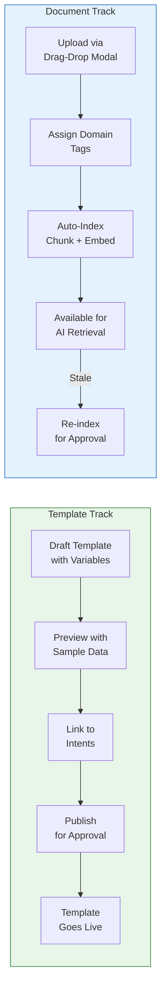

> [Screenshot: Content Library — template editor with variable preview, version history, and document list with indexing status and Indexing Hub sidebar]

---

### 3.7 Guardrails Config — *Safety policy management*

**Primary users:** Technical BA (edit) | ADMIN (edit + approve) | BA, DEV (view-only)

Configures the safety layer that screens all AI interactions. Prevents the chatbot from discussing blocked topics, using denied phrases, or generating hallucinated/unsafe content.

**What users can do:**
- Add/remove blocked topics (e.g., "Cryptocurrency", "Tax Avoidance", "Competitor Products")
- Add/remove denied words and phrases (e.g., "guaranteed returns", "risk-free")
- Edit the exclusion response template (what the chatbot says when a topic is blocked)
- Adjust sensitivity levels for hallucination detection: Off / Low / Medium / High / Strict
- Adjust sensitivity levels for prompt injection detection: Off / Low / Medium / High / Strict
- Toggle PII masking on/off
- Test queries against guardrail rules and see pass/block/flag results with detailed explanations
- **Note:** Guardrails Config is currently accessed as an embedded panel within the Observability dashboard, not as a standalone tab

**Key workflow:**

1. Compliance flags that chatbot should not discuss competitor products
2. Technical BA adds "Competitor Products" to blocked topics
3. Technical BA tests: types "How does DBS savings compare?" → guardrail blocks it
4. Technical BA submits policy change for approval
5. Checker approves → policy goes live
6. All future queries mentioning competitors return the exclusion template response

**Business value:** Prevents the chatbot from creating liability (Air Canada scenario). Configurable sensitivity levels allow fine-tuning the balance between safety and usability.

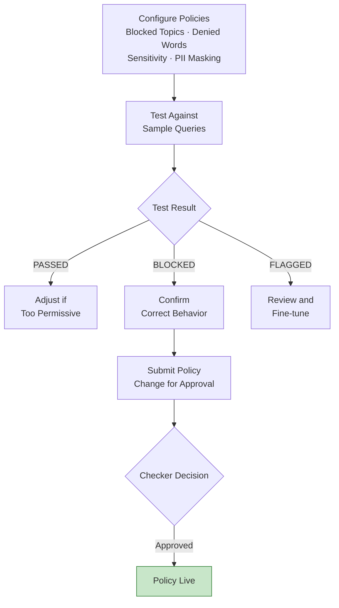

> [Screenshot: Guardrails Config — blocked topics list, sensitivity sliders, and test panel]

---

### 3.8 Audit Trail — *Immutable compliance record*

**Primary users:** All roles (read-only) | Compliance/Auditors

A read-only, immutable log of every action taken in the platform. Cannot be modified or deleted — enforced at the database level. Designed for MAS TRM 9.1.3 compliance.

**What users can do:**
- View chronological log of all system actions
- Filter by: action type, entity type (intent/agent/template/guardrail/document/system/approval), actor role (TBA/MGMT/ADMIN/BA/DEV), severity (info/warning/critical)
- Search by actor name, entity name, or description
- Set date range for targeted investigation
- Expand events to view before/after state diffs (for configuration changes)
- Paginate through results (15 per page)
- Export filtered results as CSV for compliance reporting

**Key workflow:**

1. Compliance officer needs to audit all guardrail changes in the last quarter
2. Filters: Entity Type = "Guardrail", Date Range = last 3 months
3. Reviews each event — expands to see before/after policy state
4. Exports as CSV → attaches to MAS compliance report

**Business value:** Satisfies MAS TRM requirement for immutable audit logging with minimum 7-year retention. Every action is attributed to a specific person and role — no anonymous changes possible.

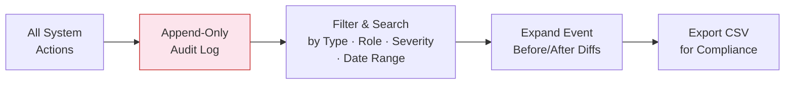

> [Screenshot: Audit Trail — filtered event list with expanded before/after diff]

---

### 3.9 Change Control — *Approval queue and emergency controls*

**Primary users:** Technical BA (approve/reject) | MGMT (approve/reject) | ADMIN (approve/reject + kill switch)

The central approval hub. All maker-checker items across the entire platform flow here.

**What users can do:**
- View pending approval queue (all actions awaiting checker decision)
- Review change details: what changed, who submitted, when, and why (with action type badges color-coded by category)
- Approve pending actions with optional review note
- Reject pending actions with mandatory rejection reason
- View recent decisions (last 5 approved/rejected items)

**Note:** Kill switch activation/deactivation controls are in the **Observability** dashboard, not Change Control. Kill switch approval requests do appear in the Change Control queue for checker sign-off.

**Key workflow (Approval):**

1. Admin opens Change Control → sees 3 pending approvals
2. Reviews first item: "Promote batch of 5 intents to production" submitted by BA
3. Examines the batch items listed
4. Approves with note: "Reviewed utterances, all aligned with Q2 product update"
5. System promotes intents, creates audit events, takes snapshots

**Key workflow (Kill Switch):**

1. Anomaly detected: chatbot producing unexpected responses
2. TBA/Admin submits kill switch activation → added to approval queue
3. Checker approves → kill switch takes effect, all GenAI disabled
4. All customer queries now receive template-only responses (safe fallback)
5. Team investigates root cause
6. TBA/Admin submits kill switch deactivation → requires separate checker approval
7. Checker approves → AI routing resumes

**Business value:** Single point of control for all platform changes. The kill switch provides a "break glass" mechanism with maker-checker governance — even emergency actions require a second pair of eyes, ensuring no single actor can unilaterally disable or re-enable AI.

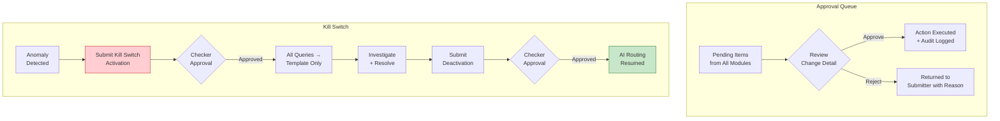

> [Screenshot: Change Control — pending approval queue with action type badges and approve/reject flows]

---

## 4. Access and Permissions

### 4.1 Role Definitions

| Role | Who | Responsibilities |
|------|-----|-----------------|
| **TBA** (Technical BA) | Senior business staff with technical aptitude | The **maker** role. Makes all configuration changes: intents, agents, guardrails, templates, documents. Can also review and approve other TBAs' submissions. |
| **MGMT** (Senior Management) | Directors, VP, CxO | A **reviewer** role. Can approve/reject TBA submissions. Read-only access to dashboards and metrics. Monitors cost, performance, and compliance. |
| **ADMIN** (Administrator) | Platform administrators | A **reviewer + operator** role. Approves all action types, controls kill switch, manages users, handles emergency operations. |
| **BA** (Business Analyst) | General business staff, product managers | **View-only**. Can view intents, dashboards, audit trail, and metrics. Cannot make or approve changes. |
| **DEV** (Developer) | Engineering team that builds the platform | **View-only**. Can view the platform for debugging and support purposes. Does not use the platform operationally. |

### 4.2 Permission Matrix

| Resource | TBA | MGMT | ADMIN | BA | DEV | Why |
|----------|-----|------|-------|-----|-----|-----|
| **Intents** | Read/Write | Read | Read/Write | Read | Read | TBAs make changes; MGMT/ADMIN review; BA/DEV observe |
| **Agents** | Read/Write | Read | Read/Write | Read | Read | Agent config affects model behavior and cost — requires technical aptitude |
| **Guardrails** | Read/Write | Read | Read/Write | Read | Read | Safety policies require technical understanding to configure correctly |
| **Templates** | Read/Write | Read | Read/Write | Read | Read | TBAs manage response templates; others view |
| **Documents** | Read/Write | Read | Read/Write | Read | Read | TBAs manage knowledge base; others view |
| **Audit Trail** | Read | Read | Read | Read | Read | Immutable — no one can write. DELETE revoked at database level |
| **Metrics / Dashboard** | Read | Read | Read | Read | Read | All roles benefit from visibility; MGMT's primary view |
| **Kill Switch** | Read/Write | Read | Read/Write | Read | Read | Emergency control requires operational expertise |
| **User Management** | — | — | Read/Write | — | — | User provisioning is admin-only (least privilege) |
| **Approvals** | Submit + Approve | Approve | Submit + Approve | — | — | TBA submits (maker); TBA/MGMT/ADMIN approve (checker). Maker ≠ checker enforced. |

### 4.3 Why These Boundaries

- **Only TBAs can make changes** — all configuration changes (intents, agents, guardrails, templates, documents) require technical aptitude. This concentrates write access in a trained role and reduces the risk of well-intentioned but incorrect modifications.
- **MGMT can review but not edit** — management serves as a checker/approver, providing oversight without needing to operate the platform directly. This keeps the maker-checker separation clean.
- **BAs and DEVs are view-only** — BAs can observe the platform's state (useful for understanding chatbot behavior and providing feedback to TBAs). DEVs can view for debugging and support but do not use the platform operationally.
- **No one can modify audit logs** — DELETE and UPDATE are revoked at the database level. This is not a permission setting — it is a database constraint. Even admins cannot tamper with the audit trail.
- **Kill switch requires TBA or ADMIN** — activating the kill switch has immediate customer impact. Only roles with operational understanding should have this power.

---

## 5. Cross-Cutting Concerns

### 5.1 Maker-Checker Workflow

Every write operation in the platform follows the **"never alone" principle** (MAS TRM 9.1.1). The person who submits a change (maker) cannot be the same person who approves it (checker).

- **Makers:** Technical BA only — the sole role with write access
- **Checkers:** Another Technical BA (peer review), MGMT, or ADMIN — maker ≠ checker enforced at API level

**Actions requiring maker-checker approval:**

| Category | Action Types |
|----------|-------------|
| **Intents** | Toggle status, Edit, Rollback, Promote batch |
| **Agents** | Config change, Status change, Kill switch |
| **Guardrails** | Policy change |
| **Templates** | Publish, Restore |
| **Documents** | Reindex, Delete, Full reindex |
| **System** | Kill switch activation, Kill switch deactivation |

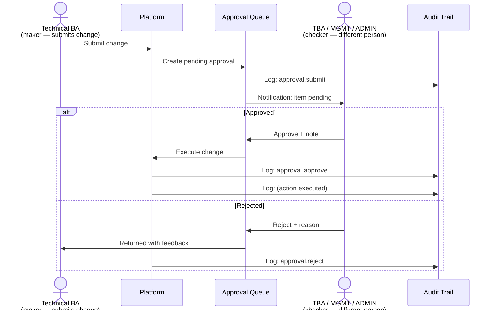

**Key enforcement:** The system validates that `checker_id ≠ maker_id` at the API level. Self-approval is rejected regardless of role. Only TBA, MGMT, and ADMIN roles can appear as checkers; BA and DEV roles have no approval capability.

### 5.2 Kill Switch and Emergency Controls

The kill switch is the platform's "break glass" mechanism. **Both activation and deactivation require maker-checker approval** — no unilateral action is possible.

- **Activation requires approval** — TBA or ADMIN submits activation request, a different checker must approve before it takes effect
- **All GenAI paths disabled** — upon approval, every customer query receives a template response instead
- **Deactivation requires approval** — resuming AI requires a separate maker-checker cycle (prevents premature reactivation)
- **State persists** — kill switch state survives page refreshes and session changes

**Where the kill switch appears:**
- **Observability** — activation/deactivation controls with confirmation dialog (creates approval + audit event)
- **Change Control** — kill switch approval requests appear in the queue for checker sign-off
- **Top header** — pulsing red "Kill Switch Active" badge when enabled; green "System Secure" indicator when disabled
- **Lifestyle Discovery** — falls back to Visual Picker only (Vision Upload disabled) when kill switch is active

---

## 6. How Tabs Connect — End-to-End Lifecycle

The 11 modules form a complete lifecycle for chatbot content management, from knowledge discovery through production deployment and ongoing monitoring:

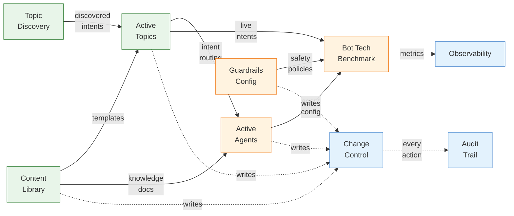

**The lifecycle in narrative form:**

1. **Discover & Create** — Upload knowledge documents → AI identifies new/changed intents → create manually or accept AI suggestions → promote to production (Topic Discovery)
2. **Manage** — View, edit, filter, and maintain existing intents — adjust response modes, review per-intent history, restore versions (Active Topics)
3. **Support** — Create response templates and upload knowledge documents for AI retrieval (Content Library)
4. **Configure** — Set up AI agents with system prompts and route intents to them (Active Agents)
5. **Protect** — Define guardrail policies: blocked topics, denied phrases, sensitivity levels (Guardrails Config)
6. **Discover Lifestyle Preferences** — Use AI-powered image-based assessment to classify customer lifestyle tier and generate personalized product recommendations (Lifestyle Discovery)
7. **Approve** — Review and approve all changes through maker-checker workflow (Change Control)
8. **Monitor** — Track query volume, agent performance, cost, guardrail hit rates, and kill switch controls (Observability)
9. **Audit** — Every action is permanently recorded for compliance and investigation (Audit Trail)

---

## Appendix: Slide Conversion Guide

When converting this document to a presentation deck:

| Section | Suggested Slides | Notes |
|---------|-----------------|-------|
| Executive Overview | 2 slides | One narrative, one diagram |
| Platform Modules | 1 slide | Grouped module diagram |
| Tab Walkthroughs (each) | 2 slides each | One workflow, one screenshot |
| Permissions Matrix | 1-2 slides | Table + role descriptions |
| Maker-Checker | 1 slide | Sequence diagram |
| Kill Switch | 1 slide | Activation/deactivation flow |
| How Tabs Connect | 1 slide | Integration diagram |
| **Total** | **~25-28 slides** | Add title + closing slides |
