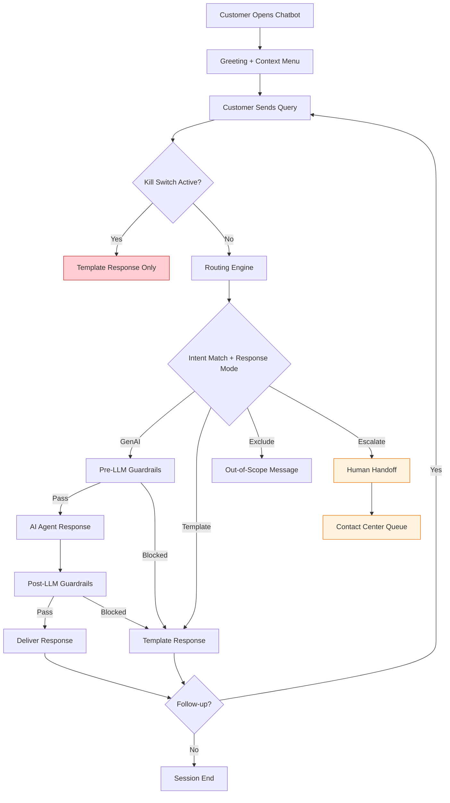
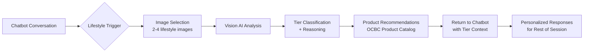
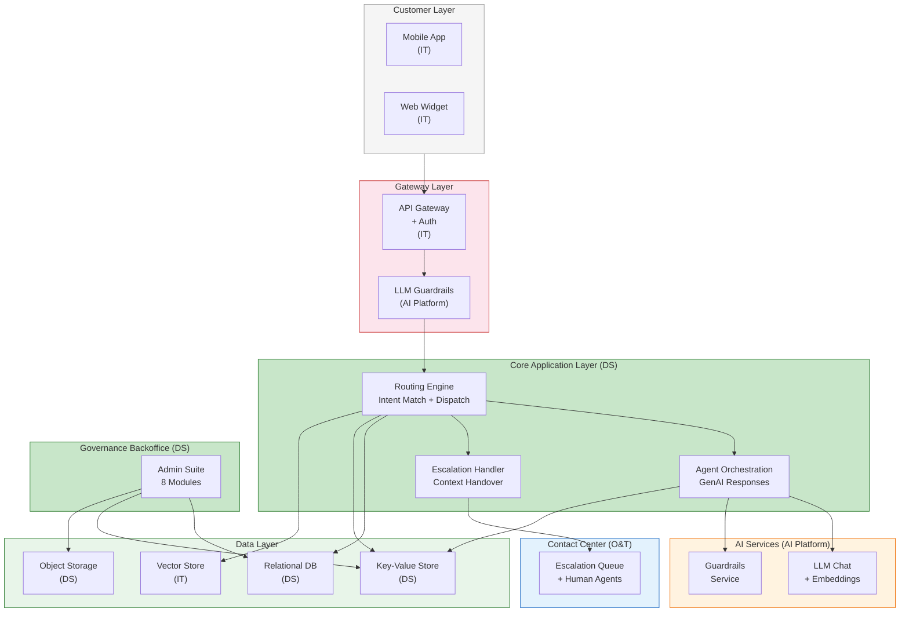
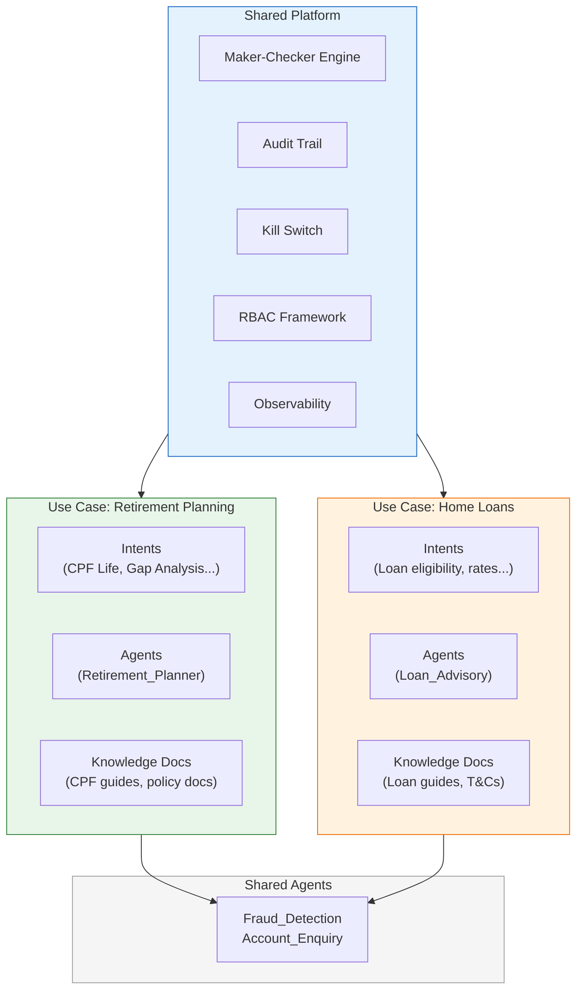
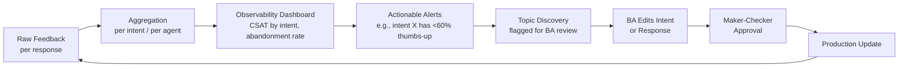
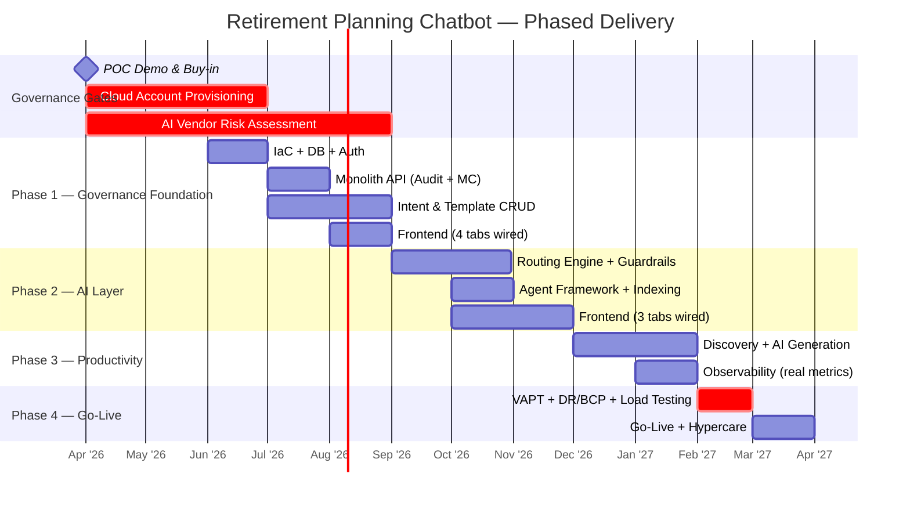

# OCBC Retirement Planning Chatbot — Product Overview PRD

> Product-level requirements for the full chatbot platform: the customer-facing chatbot + the governance backoffice that manages it.
>
> **Date:** 2026-03-29
> **Version:** 1.0
> **Status:** Draft
> **Audience:** Senior management (business case) | Cross-team leads — DS, IT, AI Platform, O&T (planning)
> **Related:**
> - [Admin Suite PRD](PRD.md) — detailed backoffice module specifications (DS team internal)
> - [Developer Specification](../DEVELOPER_SPECIFICATION.md) — system architecture, API spec, data model, timeline
> - [Vendor-Agnostic Strategy](../STRATEGY_VENDOR_AGNOSTIC.md) — architecture decisions, phased roadmap, cost projections, MAS compliance

---

## 1. Product Vision

### 1.1 Problem

Banks deploying GenAI-powered customer-facing chatbots face three converging challenges:

1. **Regulatory scrutiny** — MAS TRM guidelines (9.1.1, 12.2.2) and the November 2025 AI governance consultation paper require segregation of duties, immutable audit trails, AI inventory, and lifecycle controls for any AI system interacting with customers.
2. **Hallucination and safety risk** — GenAI models can produce financially inaccurate, misleading, or non-compliant responses. A banking chatbot giving incorrect CPF advice or unsolicited investment recommendations creates regulatory and reputational exposure.
3. **No off-the-shelf governance** — Existing chatbot platforms (Dialogflow, Amazon Lex, Azure Bot Service) provide conversation management but lack banking-grade governance: maker-checker approval, compliance audit trails, emergency kill switches, and multi-role access control.

### 1.2 Product

An **external-facing AI-powered chatbot** for OCBC customers, starting with retirement planning, backed by a **governance-first admin control interface** that ensures every chatbot configuration change is tracked, approved, and auditable.

The product has two layers:

| Layer | What It Does | Who Uses It | Who Builds It |
|-------|-------------|-------------|---------------|
| **Customer-Facing Chatbot** | Answers customer queries about retirement planning via mobile/web | OCBC customers | DS (core routing) + IT (gateway, mobile app) + AI Platform (LLM, guardrails) |
| **Governance Backoffice** | Manages intents, agents, content, guardrails, approvals, and audit | Technical BAs, Developers, Management, Admins | DS (primary owner) |

### 1.3 North Star

> *"Unified platform first, AI second."*

The governance, audit, and control features are the foundation that unlocks AI safely. This is not an AI project that happens to have governance — it is a **governance platform that enables AI**.

### 1.4 Multi-Use-Case Vision

Retirement planning is the first use case. The platform is designed to onboard additional use cases on the same infrastructure:

| Use Case | Status | Timeline |
|----------|--------|----------|
| Retirement Planning | First customer (POC complete) | Phase 1-4 |
| Home Loans | Planned | After retirement go-live |
| Card Services | Planned | After retirement go-live |
| Wealth Advisory | Planned | After retirement go-live |

Each use case shares the governance layer (maker-checker, audit, kill switch, RBAC) and platform infrastructure, while maintaining isolated intents, knowledge bases, and agent configurations. See [Section 6: Multi-Use-Case Architecture](#6-multi-use-case-architecture) for the design.

### 1.5 Document Scope

| Topic | Covered In |
|-------|-----------|
| Product vision, KPIs, end-user experience, cross-team architecture, multi-use-case design, first-customer roadmap | **This document** |
| Detailed admin suite module specifications (intent CRUD, agent config, audit trail UI, approval workflows) | [Admin Suite PRD](PRD.md) |
| System architecture, API schemas, data model, team ownership, delivery timeline | [Developer Specification](../DEVELOPER_SPECIFICATION.md) |
| Architecture decisions, vendor options, cost projections, MAS compliance mapping | [Vendor-Agnostic Strategy](../STRATEGY_VENDOR_AGNOSTIC.md) |

---

## 2. Success Metrics

### 2.1 Chatbot KPIs (End-User)

| KPI | Definition | Target | Measured By |
|-----|-----------|--------|-------------|
| Containment Rate | % of queries resolved without human handoff | [TBD — agree with retirement planning group] | Observability module: resolved vs escalated queries |
| Customer Satisfaction (CSAT) | Post-conversation rating | [TBD] | In-chat feedback prompt (thumbs up/down + optional comment) |
| Cost per Query | Total LLM + infrastructure cost / total queries | [TBD] | Observability module: Agent Cost Intelligence |
| Response Latency (p50) | Median time from query to first response token | [TBD — varies by routing mode, see Section 3.3] | Routing trace timestamps |
| Response Latency (p95) | 95th percentile response time | [TBD] | Routing trace timestamps |
| Fallback Rate | % of queries routed to template (non-GenAI) fallback | [TBD] | Routing mode distribution in Observability |
| Escalation Rate | % of queries escalated to human agent | [TBD] | Escalation event count / total queries |
| Conversation Abandonment | % of sessions where customer leaves mid-conversation | [TBD] | Session timeout without resolution |

### 2.2 Platform KPIs (Admin Suite)

| KPI | Definition | Target | Measured By |
|-----|-----------|--------|-------------|
| Time-to-Deploy Intent | Business days from BA submission to production deployment | [TBD — target < X business days] | Approval timestamp delta |
| Approval Turnaround | Hours from submission to checker decision | [TBD — target < X hours for P0 changes] | Approval queue metrics |
| Audit Completeness | % of system changes with full audit trail | 100% (non-negotiable for MAS compliance) | Audit log integrity checks |
| Kill Switch Activation Time | Seconds from trigger to all GenAI routing disabled | [TBD — target < X seconds] | Kill switch event timestamps |
| System Availability | Uptime of backoffice + chatbot routing | [TBD — align with bank SLA policy] | Observability health checks |

### 2.3 Measurement Approach

All KPIs are captured through the platform's built-in Observability module (see [Admin Suite PRD Section 3.5](PRD.md#35-observability)). No external analytics tooling is required for Phase 1-3 metrics. Integration with the bank's enterprise monitoring can be added in Phase 4.

---

## 3. End-User Chatbot Experience

### 3.1 Conversation Flow

The chatbot serves OCBC customers through a conversational interface. Every customer query follows this flow:



### 3.2 Four Response Modes

Every intent is configured with one of four response modes. The routing engine dispatches each customer query accordingly:

| Mode | Behaviour | Latency | Risk Profile | When to Use |
|------|----------|---------|-------------|-------------|
| **GenAI** | AI agent generates a contextual response using RAG | ~800ms-4s | Highest — requires guardrails | Low-risk informational queries (CPF basics, general retirement info) |
| **Template** | Pre-written response with variable substitution | <50ms | Lowest — deterministic, audit-friendly | High-risk queries (investment advice), regulated responses, FAQs |
| **Exclude** | Standard out-of-scope message | <50ms | None | Queries outside chatbot scope (complaints, unrelated topics) |
| **Escalate** | Transfers conversation to human agent | N/A | None — human takes over | Complex queries, customer frustration, high-risk financial advice, explicit "speak to agent" requests |

### 3.3 Response Time SLAs

| Routing Mode | Target p50 | Target p95 | Notes |
|-------------|-----------|-----------|-------|
| Template | <50ms | <100ms | Deterministic, no LLM call |
| Hybrid (NLU + GenAI fallback) | ~800ms | ~1.5s | Recommended for production |
| Full GenAI (RAG) | 1-2s | 4s | Streaming response reduces perceived latency |
| Escalate | <2s | <5s | Time to connect to queue, not to human pickup |

### 3.4 Sample Conversation — Retirement Planning

```
Customer: How do I plan for retirement at 65?

Chatbot:  Great question! Here's a summary of retirement planning at 65:

          1. CPF Life provides monthly payouts from age 65
          2. Your CPF SA balance determines your payout tier
          3. You can top up your SA to increase payouts

          Would you like to:
          • Check your estimated CPF Life payout
          • Understand the gap between CPF and your target retirement income
          • Explore OCBC products that can supplement your retirement

Customer: What's my retirement gap?

Chatbot:  Based on general guidelines, Singaporeans typically need
          SGD 1,200-2,000/month for basic retirement expenses.

          CPF Life payouts depend on your SA balance:
          • Basic Plan: ~SGD 810-870/month
          • Standard Plan: ~SGD 1,020-1,090/month
          • Escalating Plan: ~SGD 790-850/month (increases over time)

          To get a personalized estimate, I can help you:
          • Use OCBC's retirement calculator
          • Explore RoboInvest for automated investing
          • Discover your retirement lifestyle tier [Lifestyle Discovery]

Customer: I'd like to speak to someone about this.

Chatbot:  Of course! I'm connecting you to a retirement planning
          specialist now.

          I'll share our conversation so they have full context.
          Please hold for a moment...

          [Escalated to Contact Center — Retirement Planning Queue]
```

### 3.5 Escalation to Human Agent

Escalation is a first-class routing mode — not an error state. The chatbot proactively offers escalation when appropriate and always supports explicit customer requests.

**Escalation Triggers:**

| Trigger | Detection Method | Example |
|---------|-----------------|---------|
| Low confidence match | Routing engine confidence < threshold | Query doesn't match any intent above 70% |
| Out-of-scope query | Exclude-mode intent matched | "I want to complain about a branch" |
| Customer frustration | Sentiment analysis or repeated low-rated responses | Customer sends "this isn't helping" or rates 3+ responses negatively |
| Explicit request | Intent match on escalation utterances | "speak to agent", "talk to someone", "human please" |
| High-risk financial query | Intent risk level = High + specific trigger topics | "Should I invest my CPF in stocks?" |
| Guardrail block | Post-LLM guardrail rejects AI response | AI response contained investment advice that violated guardrails |

**Context Handover Interface:**

When escalation is triggered, the chatbot provides the following to the contact center integration point:

```json
{
  "sessionId": "sess-abc123",
  "customerId": "cust-789",
  "escalationReason": "explicit_request",
  "conversationHistory": [
    { "role": "customer", "content": "How do I plan for retirement at 65?", "timestamp": "..." },
    { "role": "assistant", "content": "Great question! Here's a summary...", "timestamp": "..." },
    { "role": "customer", "content": "I'd like to speak to someone about this.", "timestamp": "..." }
  ],
  "lastIntentMatched": "Retirement_Planning_General",
  "lastConfidenceScore": 0.92,
  "customerProfile": {
    "segment": "retail",
    "language": "en"
  },
  "suggestedQueue": "retirement-planning"
}
```

**Integration Point:** DS owns the escalation trigger logic and context payload. IT/O&T owns the contact center platform integration and queue routing. The interface contract above defines the boundary.

### 3.6 Kill Switch — Customer Experience

When the global kill switch is active:
- All GenAI responses fall back to template mode
- Customers receive deterministic, pre-approved responses only
- No visible indication to the customer that AI is disabled — responses simply come from templates
- Escalation mode continues to function normally
- Lifestyle Discovery's Vision Upload feature is disabled; Visual Picker remains available

### 3.7 Channel Requirements

Channel selection is TBD (to be decided with IT). The chatbot is designed to be channel-agnostic. Requirements vary by channel type:

| Requirement | Mobile App | Web Widget | SMS | Voice |
|-------------|-----------|------------|-----|-------|
| Text responses | Yes | Yes | Yes | TTS |
| Rich formatting (markdown, links) | Yes | Yes | No | No |
| Image display (Lifestyle Discovery) | Yes | Yes | No | No |
| Image upload (Vision Upload) | Yes | Yes | No | No |
| Streaming responses | Yes | Yes | No | No |
| Escalation to human | Yes | Yes | Yes | Yes |
| Thumbs up/down feedback | Yes | Yes | No | No |

**Minimum viable channel:** Mobile app or web widget (required for full feature set including Lifestyle Discovery). SMS and voice channels would support text-only interactions with escalation.

---

## 4. Lifestyle Discovery — Integrated Experience

### 4.1 User Story

> *As a customer using the retirement planning chatbot, I want to discover my retirement lifestyle tier so I can get personalized product recommendations aligned with my lifestyle aspirations.*

### 4.2 Entry Points

Lifestyle Discovery is triggered within the chatbot conversation, not as a standalone tool:

1. **Intent trigger** — Customer asks "Help me plan my retirement lifestyle" or similar utterances
2. **Proactive suggestion** — After a retirement gap analysis, the chatbot suggests: "Would you like to discover your ideal retirement lifestyle and get personalized product recommendations?"
3. **Direct link** — Deep link from OCBC marketing campaigns or product pages (channel-dependent)

### 4.3 Flow



### 4.4 Tier Classification

| Tier | Monthly Spend | OCBC Products | Example Triggers |
|------|--------------|---------------|-----------------|
| Aspirational | SGD 8,000-15,000+ | Premier Banking, Wealth Advisory | International travel, fine dining, private clubs |
| Balanced | SGD 4,000-8,000 | RoboInvest, CPF Investment Scheme, SRS | Regional travel, education, hobbies |
| Essential | SGD 2,000-4,000 | 360 Account, CPF top-ups, Life Goals | Local leisure, nature, wellness |

### 4.5 Contextual Integration

Once classified, the tier result is stored in the session context. Subsequent chatbot responses are personalized:
- Retirement gap calculations use the tier's spending range
- Product recommendations align with the classified tier
- Follow-up questions reference the customer's aspirations

### 4.6 Channel and Kill Switch Constraints

- **Requires visual channel** (mobile app or web) — not available on SMS/voice
- **Kill switch active:** Vision Upload (user's own photo) is disabled; Visual Picker (curated images) remains functional
- Image compression (max 1024x1024) applied client-side before API call

---

## 5. Platform Architecture

### 5.1 High-Level System View

The platform consists of four functional domains owned by three teams:



### 5.2 Team Ownership Summary

| Domain | Components | Owning Team | Key Dependencies |
|--------|-----------|-------------|-----------------|
| **Customer Channels** | Mobile app, web widget, channel routing | IT | DS provides chatbot API |
| **Gateway & Networking** | API gateway, auth passthrough, rate limiting | IT | DS registers routes |
| **Core Application** | Routing engine, agent orchestration, escalation handler | DS | AI Platform provides LLM + guardrails |
| **Governance Backoffice** | All 8 admin modules (see [Admin Suite PRD](PRD.md)) | DS | — |
| **AI Services** | LLM inference, embeddings, guardrail screening | AI Platform | DS calls via HTTPS API |
| **Contact Center** | Escalation queue, human agent routing | O&T | DS provides context handover payload |
| **Data Infrastructure** | Relational DB, key-value store, object storage | DS (provisioning) + IT (hosting) | — |
| **Vector Store** | Elasticsearch for intent embeddings | IT (hosting) | DS writes (Indexing Hub) and reads (Smart Search) |

For detailed team ownership and interface definitions, see [Developer Specification Section 1.2](../DEVELOPER_SPECIFICATION.md).

---

## 6. Multi-Use-Case Architecture

### 6.1 Design Principles

The platform supports multiple chatbot use cases on shared infrastructure. Retirement planning is the first; home loans, card services, and wealth advisory will follow.

**Shared across use cases:**
- Governance layer (maker-checker, audit trail, kill switch, RBAC)
- Platform infrastructure (databases, API gateway, compute)
- Observability and cost tracking
- Escalation framework

**Isolated per use case:**
- Intents (each use case has its own intent set)
- Knowledge documents (scoped by domain)
- Agent configurations (some agents are use-case-specific)

### 6.2 Use Case as First-Class Entity

Use cases are not freeform text fields — they are managed entities with defined ownership:

| Field | Description | Example |
|-------|-------------|---------|
| `id` | Unique identifier | `retirement-planning` |
| `name` | Display name | Retirement Planning |
| `owner_team` | Business unit that owns this use case | Wealth Management |
| `status` | Active / Onboarding / Archived | Active |
| `created_at` | Onboarding date | 2026-09-01 |

### 6.3 Scoping Model



### 6.4 Design Decisions (To Be Resolved for Production)

| Decision | Options | Impact |
|----------|---------|--------|
| RBAC per use case | Can a retirement BA see home loan intents? | Determines whether role assignments are global or scoped per use case |
| Kill switch scope | Global (all use cases) vs per-use-case | Current design is global; per-use-case requires schema change |
| Agent sharing model | Shared agents accessible to all use cases vs explicit assignment | Affects agent routing table design |
| Observability partitioning | Metrics filtered by use case in UI vs separate data stores | Current dashboard has project selector; underlying data needs partitioning |

These decisions should be resolved before the second use case onboards. For retirement planning (first use case), the current global design is sufficient.

---

## 7. First-Customer Prioritization — Retirement Planning

The retirement planning group is the first and primary customer. Their needs drive Phase 1-3 feature selection. This maps the phased roadmap (see [Vendor-Agnostic Strategy](../STRATEGY_VENDOR_AGNOSTIC.md)) to customer-facing milestones.

### Day 1 — Go-Live (Must-Have)

> *"Customers can ask retirement questions and get safe, approved answers. Escalation to human agents is available. MAS compliance is demonstrable."*

| Capability | Detail |
|-----------|--------|
| 5 core retirement intents | CPF Life, Retirement Planning, Gap Analysis, Investment, Life Events |
| Template responses for high-risk intents | No GenAI for investment advice initially — deterministic, pre-approved responses only |
| GenAI responses for low-risk intents | Informational queries (CPF basics, general retirement info) use AI with guardrails |
| Kill switch operational | Emergency disable of all GenAI, fall back to templates |
| Escalation path defined | Integration point with contact center (context handover payload per Section 3.5) |
| Audit trail for MAS compliance | 100% of configuration changes audited, immutable, exportable |
| Maker-checker on all changes | No intent or agent change goes live without second-person approval |

### Day 30 — Fast-Follow

> *"AI responses are improving. Observability gives management visibility into performance and cost."*

| Capability | Detail |
|-----------|--------|
| Observability with real metrics | Query volume, CSAT, cost per agent, fallback rate — all from live data |
| Document indexing for retirement KB | CPF guides, policy documents chunked and indexed for RAG retrieval |
| Expanded GenAI coverage | Migrate additional intents from template to GenAI as confidence grows |
| Guardrail tuning | Adjust hallucination/injection sensitivity based on production data |

### Day 90 — Enhancement

> *"BAs can discover new intents from policy changes. Customers get personalized lifestyle recommendations."*

| Capability | Detail |
|-----------|--------|
| AI-assisted intent discovery | Upload new retirement policy docs, AI identifies new/changed intents |
| Lifestyle Discovery integration | If mobile app team is ready, enable in-conversation lifestyle tier assessment |
| End-user feedback collection | Thumbs up/down on responses, aggregated in Observability dashboard |
| A/B comparison data | Compare GenAI vs template performance for same intents |

---

## 8. Conversation Memory & Context

### 8.1 Why It Matters for Retirement Planning

Retirement planning is inherently a multi-session journey. A customer may:
- Ask about CPF Life payouts today
- Return next week to explore the retirement gap
- Come back a month later to check product recommendations

The chatbot must maintain useful context across these interactions without storing unnecessary personal data.

### 8.2 Memory Model

The platform uses a three-tier memory model (detailed in [Developer Specification Section 1.3](../DEVELOPER_SPECIFICATION.md)):

| Tier | What It Stores | Retention | Owner |
|------|---------------|-----------|-------|
| **Hot** | Current conversation context, agent reasoning cache, customer data for active session | Session duration (configurable per agent) | DS |
| **Warm** | Conversation history — full session transcripts | [TBD — align with bank data retention policy] | AI Platform |
| **Cold** | Routing traces, guardrail outcomes, latency measurements | [TBD — MAS requirement: minimum 1 year for audit] | AI Platform |

### 8.3 Configurable Per Agent

Each agent has context management settings (configured via the backoffice Active Agents module):

| Setting | Description | Default |
|---------|-------------|---------|
| Max conversation turns | Number of previous turns included in LLM context | [TBD] |
| Session timeout | Time before session context expires | [TBD — e.g., 30 minutes] |
| Cross-session context | Whether to reference prior sessions for returning customers | Off (privacy-first default) |

### 8.4 Privacy Considerations

- Session data may contain PII (names, CPF references, financial questions)
- MAS TRM 11.1 requires data classification before storage — session data is classified as **Confidential**
- Auto-deletion via TTL on hot-tier storage (default 24 hours)
- Cross-session context (if enabled) requires explicit customer consent and data governance approval
- All conversation history is accessible via audit trail for compliance review

---

## 9. End-User Feedback Loop

### 9.1 Feedback Collection

| Signal | Type | Collection Method |
|--------|------|-------------------|
| Thumbs up/down | Explicit | In-chat prompt after each response |
| Free-text comment | Explicit | Optional text field on thumbs-down |
| Conversation abandonment | Implicit | Session timeout without resolution or feedback |
| Escalation trigger | Implicit | Customer requested or system triggered human handoff |
| Repeated query | Implicit | Same query rephrased within a session (indicates unsatisfactory first response) |

### 9.2 Feedback Pipeline



### 9.3 Closed Loop with Topic Discovery

The feedback system connects directly to the Topic Discovery module:
- Intents with low satisfaction scores are automatically flagged for review
- High-abandonment queries are suggested as candidates for new intents
- Escalation patterns reveal gaps in chatbot coverage (e.g., "customers keep asking about X but we have no intent for it")

This creates a continuous improvement cycle: customer feedback drives intent refinement drives better responses drives higher satisfaction.

---

## 10. Future Considerations

The following capabilities are not in scope for the initial retirement planning launch but should be designed for now to avoid rearchitecting later.

### 10.1 Multilingual Support

Singapore has four official languages: English, Mandarin, Malay, and Tamil. The chatbot will initially support English only.

**Design-now decisions:**
- Add a nullable `locale` field to intent and template schemas (default: `en`) — avoids painful migration when multilingual is added
- Guardrail policies (blocked words, PII patterns) will need per-language configuration
- Modern LLMs handle multilingual natively, but response quality varies by language — evaluation needed before each language launch
- Translation layer vs per-language intents is a design decision to resolve before the second language launches

### 10.2 A/B Testing & Experimentation

To continuously improve the chatbot, the platform needs the ability to test changes in production with controlled exposure:
- Traffic splitting: serve GenAI responses to X% and Template to (100-X)% for the same intent
- Metrics comparison: containment rate, CSAT, cost per query between variants
- Builds on existing response mode architecture — an experiment is "serve mode A to cohort 1, mode B to cohort 2"
- Canary deployments for agent prompt changes (new prompt to 5% before full rollout)

### 10.3 Bot Tech Benchmark Reclassification

The Bot Tech Benchmark module (currently in the backoffice's primary navigation) is an internal evaluation and stakeholder demonstration tool. It compares three routing architectures (NLU, Hybrid, RAG) side-by-side for procurement and architecture decisions.

**Recommendation for production:**
- Move to a "Tools" or "Evaluation" section, gated behind ADMIN/DEV roles
- Not part of the customer-facing chatbot
- Retain for ongoing architecture evaluation and vendor comparison

---

## 11. Phased Roadmap Summary

This summarizes the delivery phases. For full detail including governance gates, cost projections, and risk register, see [Vendor-Agnostic Strategy](../STRATEGY_VENDOR_AGNOSTIC.md).



### Phase-to-Customer Milestone Mapping

| Phase | Duration | Customer Milestone | Cloud Cost |
|-------|----------|-------------------|------------|
| Phase 0 | Now | POC demo — stakeholder buy-in | $0 |
| Phase 0.5 | Months 1-4 | Governance approvals (parallel) | $0 |
| Phase 1 | Months 2-5 | Compliant intent management (no AI yet) | $300-700/mo |
| Phase 2 | Months 5-8 | **Day 1: Chatbot goes live** with AI + templates + escalation | $600-2,000/mo |
| Phase 3 | Months 8-10 | Day 30-90: AI discovery, observability, feedback loop | $800-2,500/mo |
| Phase 4 | Months 10-12 | Production hardening, MAS compliance package, go-live | $800-2,500/mo |

---

## 12. User Roles & Team Ownership

### 12.1 Platform Roles

Five roles govern access to the backoffice admin suite. All roles are mapped from the bank's existing identity provider (ADFS / Azure AD / Okta) via SAML/OIDC federation.

| Role | Abbreviation | Description | Primary Responsibility |
|------|-------------|-------------|----------------------|
| Technical Business Analyst | TBA | Primary maker for business configuration. Day-to-day operator of the platform. | Configures intents, templates, discovery workflows. Submits changes for approval. Tests in preview mode. |
| Business Analyst | BA | Read-only access to business configuration. Reviews content and monitors the platform without making changes. | Reviews intent content, monitors audit trail. Uses the platform for awareness and compliance review. |
| Developer | DEV | Technical configuration and system administration support. | Configures agent system prompts, guardrail policies, model parameters. Supports TBA with technical configuration. |
| Management | MGMT | Executive oversight with read-only dashboards and approval authority. | Views observability metrics, cost intelligence, kill switch status. Approves high-impact changes. |
| Administrator | ADMIN | System-level operations and backup approver for all change types. | User management, kill switch activation, system configuration. Full access for operational support. |

### 12.2 Team Ownership

| Team | Owns | Depends On |
|------|------|-----------|
| **DS (Data Science)** | Backoffice (all 8 modules), Core Application (routing, agents, escalation handler), Indexing Hub, Smart Search, Content Safety Policies, Kill Switch, Logging | IT (gateway, Elasticsearch), AI Platform (LLM, guardrails) |
| **IT** | API Gateway, Elasticsearch/Vector Store, Mobile App, External Data/CMS, Infrastructure Hosting, Postgres MS Layer | DS (route registration, index requests) |
| **AI Platform** | LLM Model Services, LLM Guardrails, Conversation History DB, Cold Storage (traces) | DS (routing calls, trace emission) |
| **O&T (Operations & Technology)** | Contact Center integration, Escalation queue routing, Human agent management | DS (escalation context payload) |

---

## 13. Document Index

| Document | Purpose | Audience |
|----------|---------|----------|
| **This document** ([PRD_OVERVIEW.md](PRD_OVERVIEW.md)) | Product vision, KPIs, end-user experience, cross-team architecture | Senior management, all team leads |
| [Admin Suite PRD](PRD.md) | Detailed backoffice module specifications | DS team |
| [Developer Specification](../DEVELOPER_SPECIFICATION.md) | System architecture, API spec, data model, timeline | DS developers, IT/AI Platform leads |
| [Vendor-Agnostic Strategy](../STRATEGY_VENDOR_AGNOSTIC.md) | Architecture decisions, vendor options, cost, MAS compliance | Senior management, engineering leads |
| [User Functionality Guide](../USER_FUNCTIONALITY_GUIDE.md) | Module walkthroughs for stakeholders | Senior management, product leads |
| [F1-infrastructure.md](F1-infrastructure.md) | Infrastructure scaffolding spec | DS DevOps |
| [F2-aurora-schema.md](F2-aurora-schema.md) | Database schema spec | DS developers |
| [F3-auth-rbac.md](F3-auth-rbac.md) | Auth and RBAC spec | DS developers, IT |
| [FE1-FE8](FE1-active-intents.md) | Individual frontend module specs | DS developers |
